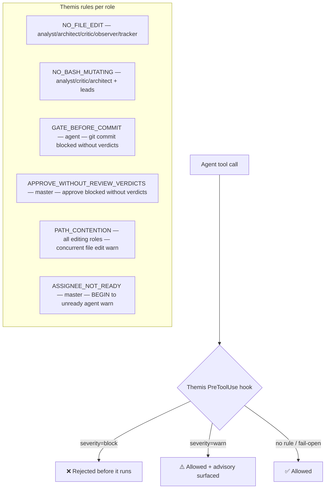
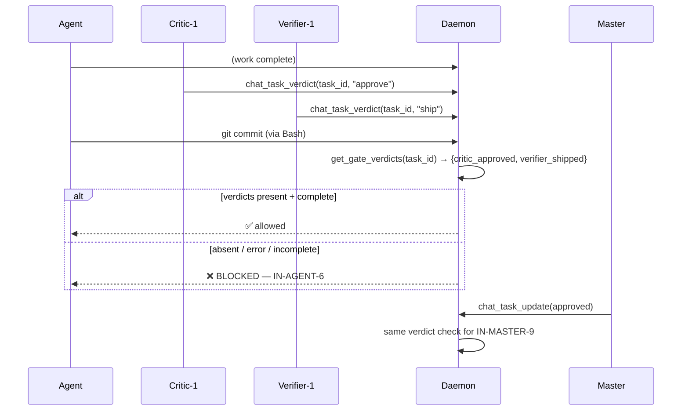
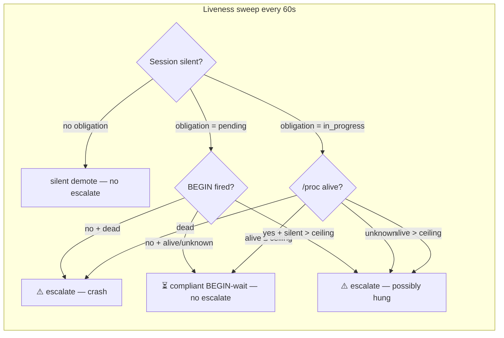
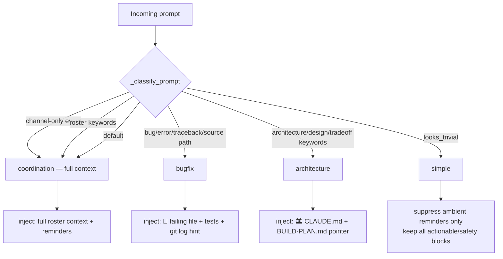

# khimaira governance model

> How khimaira enforces roster behavior and injects context — structural
> guarantees, not prose rules.

## Three-pillar model

Joseph's governing principle (2026-05-30):

```
1. HOOKS > PROMPTS — enforce behavior via executable gates, not English
2. CONTEXT ARCHITECTURE — curated/localized injection, not mega-file role docs
3. PROCESS > THRASHING — research-first lifecycle stays structural
```

The failure mode this replaces: adding a new prose rule to a role doc, watching
agents follow it for one session, then drift as context grows. Structural
enforcement doesn't drift.

---

## Enforcement layers



### Current rule inventory by role

| Role | Key rules | Severity |
|---|---|---|
| master | NO_API_DISPATCH, IN-MASTER-1..9 (heartbeat, delegate, budget, consult, parallel, batch, ready-check, no-solo-impl, approve-gate) | mix of warn/block |
| intake | NO_FILE_EDIT, NO_BASH_MUTATING, NO_API_DISPATCH, NO_STANDALONE_AGENTS, NO_MASTER_DISPATCH | block |
| agent | LOAD_DOTENV_OVERRIDE, NO_NO_VERIFY, NO_API_DISPATCH, DONE_REPORT_BRANCH, **GATE_BEFORE_COMMIT** | block |
| architect | NO_FILE_EDIT, NO_BASH_MUTATING, NO_STANDALONE_AGENTS | block |
| critic | NO_FILE_EDIT, NO_BASH_MUTATING, NO_STANDALONE_AGENTS | block |
| verifier | *(Phase 3 path-allowlist — deferred)* | — |
| observer | NO_FILE_EDIT, NO_BASH_MUTATING, NO_STANDALONE_AGENTS, NO_STANDALONE_COMMS | block |
| tracker | NO_FILE_EDIT outside STATE.md, NO_BASH_MUTATING, NO_STANDALONE_AGENTS | block |
| leads | NO_FILE_EDIT outside domain, PATH_CONTENTION | block/warn |
| member | *(empty — neutral role for backfilled members)* | — |

### The B3 gate

The commit-gate (`IN-AGENT-6`) and approve-gate (`IN-MASTER-9`) share a
structured verdict store:



**Verdict author-role binding** (593e0b9): `chat_task_verdict` enforces the
poster's role — only critic-role sessions may post `approve`/`changes`; only
verifier-role sessions may post `ship`/`hold`. Master cannot self-approve.

**Fail semantics** (Joseph's ruling):
- verdict absent → **BLOCK**
- verdict read-error → **BLOCK**
- verdicts present + complete → allow
- daemon unreachable → allow (irreducible; Guard-4 escalates)
- no active task → allow (ad-hoc commit)

---

## Structural guards (daemon-side)

### Guard-4 — idle-while-blocking escalation

Extends the existing liveness sweep. When a session with outstanding
obligations goes silent past the ceiling, the daemon escalates instead of
silently demoting:



Ceiling = `max(retry_backoff_ceiling × 1.5, api_timeout_s)` derived from
`CLAUDE_CODE_MAX_RETRIES` (default 10) and `API_TIMEOUT_MS` (default 600 000).

**Debounce**: one escalation per `(session, obligation)` pair until the
obligation clears (task status leaves `pending`/`in_progress`). Activity blips
do not re-arm.

### Guard-2 — PATH_CONTENTION concurrent file edit warn

Derived from existing `files_touched.jsonl` — no new claim registry. When an
agent edits a file another live session touched within the last 10 minutes, a
Themis warn names the other session so the editors can coordinate.

### #13b-light — throttle grace window

Extends Guard-4's liveness sweep: a session that goes silent mid-task during
CC's retry backoff (up to 10× internal retries + up to 10 min per request) is
not false-killed. `/proc`-liveness (or `psutil`) distinguishes crashed sessions
(escalate immediately) from throttled-but-alive sessions (suppress during
ceiling, escalate if alive > ceiling = hung).

---

## Dynamic context injection (#66)

The `UserPromptSubmit` hook classifies each incoming prompt and injects only
relevant context pointers — suppressing ambient reminders for trivial lookups,
surfacing architecture/bug-fix guidance for structured work.



### What is always injected regardless of class

- Inbox notes (unread cross-session answers)
- Pending task assignments + begun-not-started banners
- Missed chat events
- Role/budget directive (on first turn or role change)
- Handoff boot triggers
- Bottleneck / Guard-4 escalation notices

### What the classifier gates

| Class | Suppressed | Added |
|---|---|---|
| `simple` | ambient reminder block, role-budget block | nothing |
| `bugfix` | nothing | 🐛 reproduce-first hint |
| `architecture` | nothing | 🏛️ CLAUDE.md + BUILD-PLAN pointer |
| `coordination` | nothing | nothing |

**Safety invariant**: misclassification can only add a pointer or drop a
periodic reminder. It can never strip an actionable or safety signal.
Opt-out: `KHIMAIRA_DYNAMIC_CONTEXT=0`.

---

## Rollout discipline

Lessons from the B3 deployment (2026-05-30):

```
deploy tool → verify tool works → flip enforcement rule live
```

A BLOCK rule that depends on a new MCP tool must have that tool available in
all relevant sessions **before** the enforcement activates. Activating the
role-binding gate while `chat_task_verdict` was unavailable to critic/verifier
would have deadlocked the roster with no valid verdict-poster.

General principle: never add a trusted-origin parameter to a public API to
grant privilege; make the privileged action a separate internal code path
(the daemon-internal `_auto_signal_start` for #14a follows this).

---

## What hooks cannot enforce

Judgment-dependent rules (Class C/D in the rule→hook audit) are not candidates
for Themis enforcement — they require understanding intent, not just tool-call
patterns. For these, the answer is **better context architecture** (curated
injection, DIGEST fallback) rather than longer role docs.

Examples that are **not hookable**:
- "research before implementing"
- "challenge bad ideas"
- "one clarifying question maximum"
- "mirror user-facing status to roster"

These stay behavioral — the goal is that the context architecture makes them
salient at the right moment, not that they become physically enforced.
