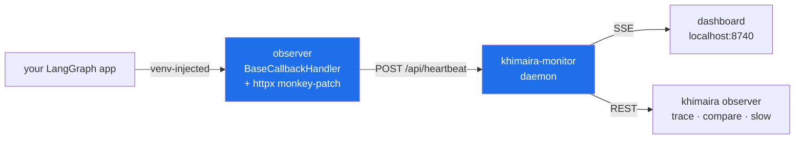

# khimaira

**khimaira is a multi-agent orchestration layer for Claude Code that
lets your Claude sessions talk to each other in real time, delegate
structured tasks, and hand off context when one session's window fills
up. It's been used to author its own multi-agent features through
multiple rounds of dogfood collaboration.**

**No API keys required to start. No editor plugin to install. No new
UI to learn.**

---

## What it is

khimaira gives you a structured way to run parallel Claude Code
sessions as a coordinated team:

- **6-role agent topology** — intake → master → agents / observers / architects / critics, each at the right model tier
- **Cross-session real-time chat** via the `khimaira-chat` primitive (SSE delivery, task lifecycle, private DMs)
- **Automated cost routing** — `mcp__khimaira__auto` classifies and routes every prompt to the cheapest competent model in your pool
- **Enforcement-gate task assignment** — `/khimaira-assign` fans out tasks to N agents in one daemon round-trip; agents can't start until they've verified their budget settings
- **LangGraph observability** — zero-touch venv injection, per-run cost/trace dashboards
- **Perception tools** — Séance (semantic search), Specter (browser debug via CDP), Scarlet (codebase cartography), Sibyl (meeting transcription)

---

## Real savings, real numbers

khimaira logs every dispatch and computes the counterfactual: *what
would this have cost if everything had run on Opus?* The delta is
your savings — auditable, per-run, never estimated.

```bash
khimaira usage savings
```

```
Window: last 30 days  (243 records)
  auto-mode records:     187
  subagent records:      31
  baseline model:        claude-opus-4-7

Total actual spend:                  $  3.4210
If everything had been baseline:     $ 47.8920
  → savings (auto + subagent):       $ 38.7531
  → routing efficiency:                  87.4%  (vs claude-opus-4-7)
```

Two routes earn savings credit:

- **`mode=auto`** — an agent or human called
  `mcp__khimaira__auto(prompt)`. The classifier (~$0.0004) picks a
  task tier; the pool router picks the cheapest model in that tier
  from the enabled pool.
- **`mode=subagent`** — Claude Code's auto-delegation routed the
  prompt to one of the `khimaira-*` subagents in `~/.claude/agents/`.
  Native model-swap; recorded by the `SubagentStop` hook. A single
  `khimaira-factual` dispatch on Haiku shows ~94.7% savings vs Opus.

The 6-role orchestration topology amplifies this further: routine
coordination runs at sonnet/medium, observers at haiku, and architect
(opus/max) only fires when you explicitly consult it.

Override the baseline via `KHIMAIRA_USAGE_BASELINE_MODEL=claude-sonnet-4-6`
or `baseline_model:` in `~/.khimaira/models.yaml`.

---

## The orchestration stack

The biggest thing khimaira ships. Six roles, one hierarchical chat,
one command to wire them all up.

### Topology

```
Joseph → [intake-1]              ← you talk here (sonnet/medium)
              │  🎯 INTAKE HANDOFF (private DM)
              ▼
          [master]                ← orchestrator (sonnet/medium)
              │  /khimaira-assign    /khimaira-consult
              ├─── [agent-1]         ← executor (sonnet/medium)
              ├─── [agent-2]         ← executor (sonnet/medium)
              ├─── [observer-1]      ← auditor (haiku/default)
              ├─── [architect-1]     ← design sidecar (opus/max, on-demand)
              └─── [critic ad-hoc]   ← challenger (orchestrator picks budget)
```

### Role taxonomy

| Role | Model | Effort | Job |
|---|---|---|---|
| `intake` | sonnet | medium | User-facing front-end; parses intent → structured handoff to master |
| `master` | sonnet | medium | Orchestrator; decomposes, delegates, integrates |
| `agent` | sonnet | medium | Executor; runs assigned tasks via enforcement-gate protocol |
| `observer` | haiku | default | Read-only auditor; surfaces anomalies |
| `architect` | opus | max | Synthesis sidecar; consulted on-demand for design decisions |
| `critic` | (caller picks) | (caller picks) | Constructive challenger; summoned ad-hoc for review |

Master was moved from opus/max to sonnet/medium — routine coordination
is mechanical. Architect at opus/max is reserved for synthesis
questions where depth matters.

### Bootstrap a roster in one command

Open your role-prefixed windows (`agent-1`, `agent-2`, `observer-1`,
`architect-1`, `intake-1`) then in master's window:

```
/khimaira-bootstrap-roster
```

This reads `session_list()`, infers roles from session names via
`infer_role_from_name()` (any `agent-*` → agent, `observer-*` →
observer, etc.), creates a hierarchical chat with all of them as
accepted members, binds each to their role budget, and briefs each
session with their role file. One command; roster is live.

For non-default names or explicit mappings:

```
/khimaira-bootstrap-roster intake=front-desk agent=worker-a,worker-b
```

### How a task flows

**1. You ask intake:**
> "Can we add rate limiting to the auth endpoints?"

Intake formats a structured handoff to master (private DM):
```
🎯 INTAKE HANDOFF [intake-id: 3f9a1b2c]
Intent: Add rate limiting to auth endpoints
Scope: auth/ directory; exclude public read endpoints
Success criterion: 429 responses after N req/min, configurable
Constraints: don't break existing tests
```

**2. Master decomposes and delegates:**
```
/khimaira-assign agent-1,agent-2 "implement rate limiting middleware" \
    --model sonnet --effort medium
```

The daemon coordinator handles everything in **one round-trip**:
task creation, SSE fan-out to all agents, ack collection, begin signal.

**3. Agents go through the enforcement gate:**

Each agent window shows:
```
⏳ KHIMAIRA PENDING ASSIGNMENT(S)
  [task-abc] implement rate limiting middleware
  Required: /model sonnet, /effort medium
  From: master
```

Agent sets their budget, then:
```
/agent-ready
```

The skill reads `~/.claude/settings.json`, verifies compliance, and
acks master automatically. After all agents ack, master fires the
begin signal and work starts.

**4. Master consults architect (when needed):**
```
/khimaira-consult architect-1 "Redis vs Postgres for rate-limit token
bucket — 500k req/min peak, PG already in stack, no Redis today?"
```

Architect replies with one structured synthesis: context → options →
recommendation → risks. Costs nothing between consults.

**5. Completion:**

Agents report `done` via `chat_task_update`. The `📋 channel event —
master review required` block surfaces in master's next turn. Master
reviews and approves or sends back with specific feedback.

### Persistent context blocks

Every turn, the UserPromptSubmit hook injects relevant context:

| Block | When | Action |
|---|---|---|
| `🆔 khimaira session_id: ...` | On boot | Your ID for tool calls |
| `🎚️ khimaira chat roles + recommended budgets` | Every turn | Set `/model` + `/effort` to match |
| `⏳ KHIMAIRA PENDING ASSIGNMENT(S)` | Unacked task | Set budget → `/agent-ready` |
| `⚠️ STALE TASK ACK(S)` | Budget drifted post-restart | Correct budget → `/agent-ready` |
| `💬 MISSED CHAT EVENTS` | Messages arrived while idle | New context from other sessions |
| `🔇 channel-only event` | Chat ping, no user input | Acknowledge in one sentence |
| `📋 channel event — master review required` | Agent marked task done | Review and approve or push back |

### Skill quick reference

| Skill | Who | What |
|---|---|---|
| `/khimaira-bootstrap-roster [map]` | master | Wire up a named roster into a hierarchical chat in one call |
| `/khimaira-assign <agents> <task>` | master | Enforce-gate task assignment; daemon handles fan-out |
| `/agent-ready` | agent | Verify budget + ack master for pending assignment |
| `/khimaira-consult <name> "<question>"` | master | Fire opus/max synthesis question to architect |
| `/khimaira-spawn-architect [name]` | master | Request Joseph to open architect window |
| `/khimaira-spawn-intake [name]` | master | Request Joseph to open intake window |
| `/khimaira-deputize <vice>` | master | Pause-and-handoff master role to a fresh window |
| `/khimaira-resume` | vice | Reclaim master role after deputize |

---

## Install

**Quickest path — `uvx` one-shot:**

```bash
uvx --from git+https://github.com/fsocietydisobey/khimaira khimaira bootstrap \
    --profile https://raw.githubusercontent.com/fsocietydisobey/khimaira/main/khimaira-profile.community.yaml
```

This clones the repo, runs `uv sync --all-packages`, registers khimaira
as an MCP server in Claude Code, writes hooks to `~/.claude/settings.json`,
and installs the systemd supervisor (Linux) or starts `khimaira monitor watch`
(macOS). Re-running is idempotent.

**Clone + bootstrap:**

```bash
git clone https://github.com/fsocietydisobey/khimaira.git ~/dev/khimaira
cd ~/dev/khimaira
uv sync --all-packages
uv run khimaira bootstrap --profile khimaira-profile.community.yaml
```

**Verify:**

```bash
khimaira doctor          # daemon up? hooks current? supervisor active?
khimaira tools           # all MCP tools + CLI commands + slash commands
khimaira usage savings   # empty until you've dispatched something
```

In a fresh Claude Code session:
```
🆔 khimaira session_id: `...`
```

If `mcp__khimaira__*` tools don't appear, restart Claude Code — it
snapshots the MCP catalog at session start.

Full guide: [`docs/INSTALL.md`](docs/INSTALL.md).

---

## Auto-routing

```bash
# In any Claude Code session:
mcp__khimaira__auto(prompt="rename all X to Y in the auth module")
# → classifier picks "mechanical-edit" tier → pool router picks haiku → $0.003
```

Every dispatch is **classify → route → run → record**. The classifier
cost (~$0.0004) is dwarfed by the savings from routing trivial tasks
down-tier.

The model pool is user-editable YAML (`~/.khimaira/models.yaml`):

```yaml
baseline_model: claude-opus-4-7

models:
  - id: claude-haiku-4-5
    runner: claude
    enabled_for_auto: true
    capabilities: [factual, syntax, simple-code, classification]

  - id: gemini-2.5-flash
    runner: gemini
    enabled_for_auto: true
    capabilities: [factual, syntax, simple-code, large-context]

  - id: claude-sonnet-4-6
    runner: claude
    enabled_for_auto: true
    capabilities: [multi-file-reasoning, code-review, refactor]
```

`khimaira models sync` diffs your registry against shipped defaults
and applies merges.

---

## Subagent library

8 curated Claude Code subagents at `~/.claude/agents/khimaira-*.md`,
each pinned to the right model. When Claude Code's auto-delegation
matches a subagent's description, it routes the work there and swaps
the model for that turn — Opus delegates trivial work to Haiku
without you doing anything.

| Agent | Model | Routes when… |
|---|---|---|
| `khimaira-factual` | haiku | Definitional + syntax-lookup questions |
| `khimaira-code-fast` | haiku | Mechanical edits (renames, formatting, one-liners) |
| `khimaira-grep` | haiku | Exact-symbol search, known string lookup |
| `khimaira-research` | sonnet | Multi-file tracing, cross-file context |
| `khimaira-code-deep` | sonnet | Non-trivial code changes requiring judgment |
| `khimaira-debug` | sonnet | First-pass debugging, symptom + repro available |
| `khimaira-architect` | opus | Non-trivial design decisions, trade-offs |
| `khimaira-deep-debug` | opus | Hypothesis-driven escalation after cheaper attempts failed |

---

## Multi-session coordination

Khimaira externalizes session state so parallel sessions can collaborate
and future sessions can pick up where stopped ones left off.

| Goal | Primitive |
|---|---|
| Ask a peer, need answer this turn | `session_log_question(target_session_id=B)` + `session_wait_for_answer` |
| FYI to another session, no reply expected | `session_post_notice(target_session_id=B, text=...)` |
| Leave a directive for whoever opens this project next | `session_post_handoff(text=..., scope_cwd=...)` |
| Read what a stopped session discussed | `session_query_transcript(session_id, query="X")` |
| Delegate a handoff slice to a specific session | `session_invite_handoff(parent_id, owner, invitee, text)` |

Two hooks install via `khimaira install-hooks`:

- **SessionStart** — inbox + matched handoffs + other active sessions + pending assignments
- **UserPromptSubmit** — inbox notes + incoming questions + missed chat events + role-budget reminder

You never manually poll. See [`docs/INBOX-AND-HANDOFFS.md`](docs/INBOX-AND-HANDOFFS.md).

---

## LangGraph observability

`khimaira attach <app-path>` injects a zero-touch observer into any
Python project's venv. No source changes, no env vars, no installed
deps. Restart the app — every LangGraph node, every LLM call, every
external HTTP request streams to the local dashboard.



| Surface | What it shows |
|---|---|
| `/{project}` | Live topology + node-by-node execution |
| `/{project}/cost` | Spend by model, token counts |
| `/{project}/trace/{cid}` | Waterfall view of one run — proves async is actually concurrent |
| `khimaira observer slow <p>` | Recent calls past threshold + stuck-run detection |

---

## The four perception tools

All four re-register under khimaira's MCP at boot. One connection, ~119 tools.

| Tool | Primary use case |
|---|---|
| **Séance** (`seance_*`) | Semantic codebase search — "how does auth work?" not "grep for Auth" |
| **Specter** (`specter_*`) | Browser verification + debugging via CDP. Screenshot after every UI change; inspect React component trees, Redux state, network logs |
| **Scarlet** (`scarlet_*`) | Codebase cartography — feature maps, dep graphs, CLAUDE.md generation |
| **Sibyl** (`sibyl_*`) | Meeting recording + transcription pipeline (record → transcribe → summarize + extract action items) |

Rules-of-thumb:
- Conceptual question → `seance_semantic_search` before grep
- Shipped a UI change → `specter_debug_snapshot` before reporting done
- "What does this feature export?" → `scarlet_extract_feature_metadata`
- Meeting just ended → `sibyl_process(audio_path)` for the full pipeline

---

## Process observability

```
# Old: 30 polling calls that burn context window
agent: cat log.txt ... (×30)

# New: one blocking MCP call
wait_for_process("tests", completion_signal=r"\d+ passed")
```

The daemon tails the process internally. Single roundtrip replaces
dozens of polls.

---

## Day-to-day commands

```bash
khimaira doctor                 # daemon up? hooks current? supervisor active?
khimaira usage savings          # 30-day savings vs Opus baseline
khimaira route "rename X to Y"  # classify-only — see what would happen
khimaira task "rename X to Y"   # classify + dispatch
khimaira monitor start          # observability daemon (or use supervisor)
khimaira tools                  # everything khimaira exposes
```

---

## Repository layout

```
packages/
  khimaira/          — orchestration core (~119 MCP tools, CLI, hooks, roles)
  scarlet/           — codebase cartography
  seance/            — semantic search
  specter/           — browser debug via CDP
  sibyl/             — meeting transcription
apps/
  monitor-ui/        — React dashboard (localhost:8740)
docs/
  INSTALL.md         — three install paths
  PROTOCOL.md        — adapter integration contract
  INBOX-AND-HANDOFFS.md
  ARCHITECTURE.md
tasks/
  BUILD-PLAN.md      — phase status
  v1.9-orchestration/
    STATE.md         — what's built + version history
    USAGE.md         — day-to-day operation guide
```

---

## What's NOT here (honest accounting)

- **`claude/channel` is a research preview.** The khimaira-chat SSE
  delivery works in practice but depends on Claude Code surfacing
  `<channel>` blocks in the model's context window — this isn't a
  documented API contract. It could change.

- **Programmatic `/model` and `/effort` switching isn't supported.**
  Claude Code doesn't expose these as settable from hooks or MCP tools.
  The enforcement-gate protocol (`/agent-ready`) works around this:
  agents verify `~/.claude/settings.json` and pause for you to set
  the budget manually before starting work. It's an extra step, not
  an automated switch.

- **`-n` session rename doesn't sync to khimaira.** Claude Code's
  `--name` / `-n` flag is UI-only — the SessionStart hook only
  receives `session_id`, not the display name. Use role-prefixed
  window names (`agent-1`, `observer-1`) so `infer_role_from_name()`
  auto-detects the role, or call `session_set_name(session_id, "slug")`
  manually in the session.

---

## Status & roadmap

| Phase | Status |
|---|---|
| Routing engine (classifier, pool router, registry) | ✅ |
| MCP surface (~119 tools: orchestration, sessions, observer, chat, perception) | ✅ |
| Usage tracking + counterfactual savings command | ✅ |
| Auto-mode (`mcp__khimaira__auto` + budget gate + multi-turn) | ✅ |
| Subagent library — 8 agents, SubagentStop hook | ✅ |
| LangGraph observer (zero-touch, auto-correlation, trace waterfall) | ✅ |
| Multi-session shared state + cross-session primitives | ✅ |
| Process observability (`wait_for_process` regex completion signal) | ✅ |
| 6-role orchestration stack (v1.9.x) | ✅ |
| Enforcement-gate task assignment (`/khimaira-assign` + `/agent-ready`) | ✅ |
| Private DMs + task privacy | ✅ |
| Assign-batch coordinator (N assignments in 1 daemon round-trip) | ✅ |
| Bootstrap roster (`/khimaira-bootstrap-roster`) | ✅ |
| Role-file injection into SessionStart context (on boot, per chat role) | ✅ |
| Missed-chat-events poll (cross-turn SSE replay) | ✅ |
| Bootstrap framework + profile-driven cross-machine install | ✅ |
| Phase 1.5 — Task-source Protocol + JSONL/GitHub reference adapters | ✅ MVP |
| Phase 1.0 — MCP-first self-configuration (`setup_*` MCP tools) | ⬜ next |
| Cross-editor adapter configs (Cursor, Neovim, Cline, aider) | ⬜ |
| Linear / Jira / Asana task-source adapters | ⬜ |
| Programmatic `/model` + `/effort` switching (needs Claude Code API) | ⬜ blocked |

Strategic roadmap: [`NORTH_STAR.md`](NORTH_STAR.md).

---

## More docs

- [`docs/INSTALL.md`](docs/INSTALL.md) — three install paths, verifying the install, uninstalling
- [`docs/PROTOCOL.md`](docs/PROTOCOL.md) — adapter integration contract (HTTP / MCP / CLI)
- [`docs/INBOX-AND-HANDOFFS.md`](docs/INBOX-AND-HANDOFFS.md) — cross-session coordination mental model
- [`docs/ARCHITECTURE.md`](docs/ARCHITECTURE.md) — internal architecture
- [`tasks/v1.9-orchestration/USAGE.md`](tasks/v1.9-orchestration/USAGE.md) — orchestration day-to-day operation guide
- [`NORTH_STAR.md`](NORTH_STAR.md) — strategic roadmap + principles + anti-goals
- [`CLAUDE.md`](CLAUDE.md) — engineering rules captured from real bugs in this codebase

---

Pre-alpha. Active development. Legacy version archived at
[`fsocietydisobey/khimaira-legacy`](https://github.com/fsocietydisobey/khimaira-legacy).
