# khimaira

> Multi-model AI orchestration + LangGraph observability + multi-session collaboration for the terminal AI era.

khimaira is a dev framework that makes your terminal AI tool — Claude Code, Codex CLI, Gemini CLI, or local Ollama — 5–10× more efficient. Three things in one:

1. **Orchestrator** — pre-resolves task-relevant context, manages your dev stack with a debugger-attached browser, and routes every prompt to the cheapest competent model.
2. **LangGraph observer** — zero-touch venv-injected tracing for any LangGraph app. Auto-correlates runs, captures external HTTP (Roboflow, OpenAI, Anthropic), surfaces cost + slow calls + waterfall traces in a local dashboard.
3. **Multi-session shared state** — externalize session decisions, file touches, questions; coordinate parallel Claude/Codex/Gemini windows via targeted questions, real-time blocking calls, FYI notices, and forward-looking handoffs that survive across sessions.

**No API keys required to start; bring your own when you want premium models.**

---

## How it fits into your workflow

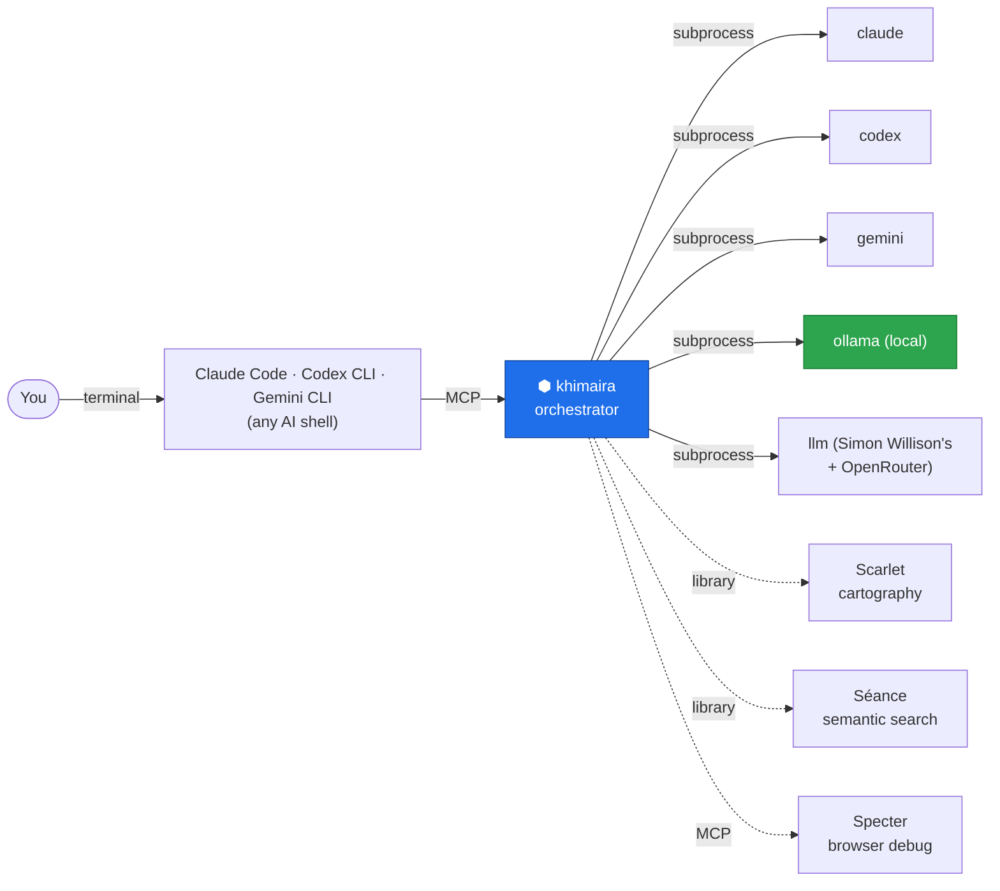

You drive your AI shell as usual. Khimaira is the layer that picks the right tool for each task and shrinks the prompt before it goes out.

---

## Three pillars

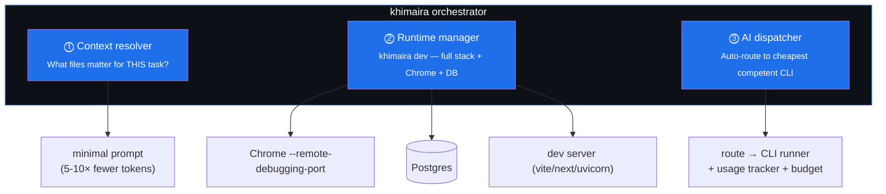

1. **Context resolver** — Séance (semantic search) + Scarlet (codebase cartography) + grep + filesystem heuristics. Answers *"what files actually matter?"* before anything hits the LLM. Where the 5-10× token reduction lives.
2. **Runtime manager** — `khimaira dev` starts your dev server, launches Chrome with `--remote-debugging-port` for Specter, ensures khimaira-monitor is up. One Ctrl-C tears it all down.
3. **AI dispatcher** — auto-router (AMR pattern) classifies each task and dispatches to the cheapest competent CLI runner: Claude Code, Codex, Gemini, Ollama, or `llm` (Simon Willison's, covers OpenRouter + 100+ providers).

---

## How a single task flows through khimaira

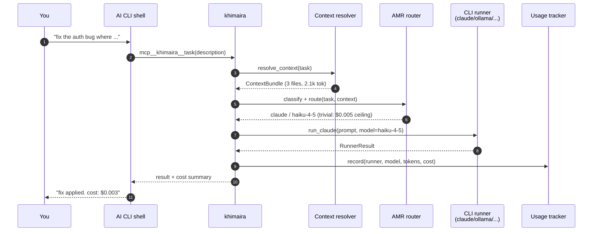

Every dispatch is **classify → route → run → record**. The classifier is a small cheap call (~$0.0004); the savings from routing trivial tasks down-tier dwarf its cost.

---

## Why pure CLI substrate

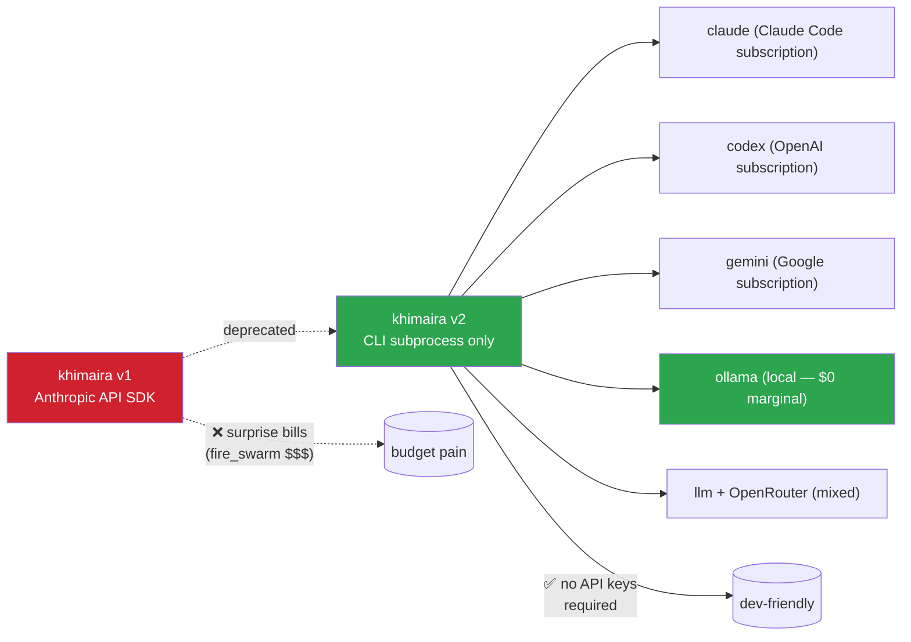

**Pitch in one sentence:** *"khimaira orchestrates your terminal AI tools without ever making an API call of its own. No keys, no surprise bills, no external SDK dependencies."*

---

## Repository layout

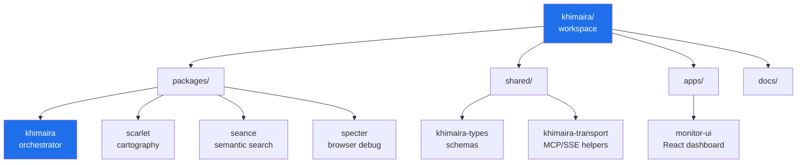

Each `packages/<name>/` has both:
- a **library API** (`<name>.api.*`) for in-process use by khimaira
- an **MCP server** (`<name>.server.mcp`) for direct shell use

Same logic, two transports — like an SDK and a SQL interface to the same database engine.

---

## Quick start

### Three install paths, pick what matches you

**1. You have a khimaira "profile" YAML (you or another maintainer wrote one in dotfiles).** Fastest fresh-machine setup — one command brings the whole agent stack online (khimaira + sibling MCP servers + Claude rules/commands symlinks + supervisor + dashboard SPA):

```bash
git clone git@github.com:<you>/dotfiles.git ~/dotfiles
~/dotfiles/bootstrap.sh
```

See [Profile-driven setup](#profile-driven-setup) below for what the YAML declares. New devs can clone the example profile from this repo and adapt.

**2. You want khimaira and that's it.** No personal config, no sibling tools — just the khimaira CLI + MCP server on this box:

```bash
git clone https://github.com/fsocietydisobey/khimaira.git ~/dev/khimaira
cd ~/dev/khimaira
uv sync
uv run khimaira bootstrap   # uses khimaira-shipped default profile
```

`khimaira bootstrap` with no `--profile` arg runs the built-in baseline: registers khimaira as an MCP server with Claude Code, writes the khimaira SessionStart / UserPromptSubmit / PostToolUse hooks into `~/.claude/settings.json`, installs the host-native supervisor (systemd on Linux, launchd on macOS), builds the dashboard SPA.

**3. You're trying khimaira before committing.** Skip bootstrap, just register the MCP server manually:

```bash
# After uv sync above:
claude mcp add khimaira -s user -- bash -lc \
  'uv --directory ~/dev/khimaira run python -m khimaira.cli mcp'
```

Then `claude` and khimaira's MCP tools (`mcp__khimaira__*`) are available.

### Day-to-day commands

```bash
# Diagnose your environment (daemon up? supervisor active? hooks current?)
khimaira doctor

# Auto-routed dispatch (dry-run first to see what it'd do)
khimaira task --dry-run "rename this variable"

# Start the observability daemon (or use the installed supervisor)
khimaira monitor start
# → http://127.0.0.1:8740 (loopback only — that IS the auth layer)

# Spin up a project's full dev stack with one command
khimaira dev /path/to/project

# List every khimaira surface (CLI commands, MCP tools, slash commands, web routes)
khimaira tools
```

### Profile-driven setup

Profiles let you declare your portable agent setup in one YAML file checked into your dotfiles repo. Same profile applied on N machines yields N matching environments. Bootstrap reads the profile and:

- clones your dotfiles repo
- creates symlinks (`~/.claude/CLAUDE.md` → your dotfiles, etc.)
- clones declared sibling repos (e.g. seance, specter, scarlet) under `~/dev/`
- runs each repo's install command (`uv sync`)
- registers MCP servers with Claude Code
- writes khimaira hooks into `~/.claude/settings.json`
- installs the supervisor
- builds the dashboard SPA

```yaml
# khimaira-profile.yaml (in your dotfiles repo)
name: my-setup
dotfiles:
  repo: git@github.com:me/dotfiles.git
  path: ~/dotfiles
  symlinks:
    - { src: claude/CLAUDE.md, dest: ~/.claude/CLAUDE.md }
    - { src: claude/rules, dest: ~/.claude/rules }
    - { src: claude/commands, dest: ~/.claude/commands }
repos:
  - { name: khimaira, url: git@github.com:fsocietydisobey/khimaira.git, install: uv sync --all-packages }
mcp_servers:
  - name: khimaira
    command: uv --directory ~/dev/khimaira run python -m khimaira.cli mcp
supervisor:
  auto_install: true
install_claude_hooks: true
spa_build: true
```

Then on any machine: `khimaira bootstrap --profile <local-path-or-url>`. Idempotent — safe to re-run.

For ongoing cross-machine sync (after profile changes): `khimaira sync` from a terminal, or `/khimaira-configure` from inside any Claude Code session.

A complete example profile that does all of the above lives at [`tasks/bootstrap-profile/EXAMPLE-PROFILE.yaml`](tasks/bootstrap-profile/EXAMPLE-PROFILE.yaml).

### MCP tools

42+ MCP tools available across orchestration, monitor, process observability, and multi-session shared state. Discoverable via `khimaira tools --category mcp` — ranked by 7-day call count so the most-used tools surface first.

---

## Pillars in detail

### Pillar 1 — Context resolver

Pre-LLM "what's relevant?" — minimizes prompt before anything bills.

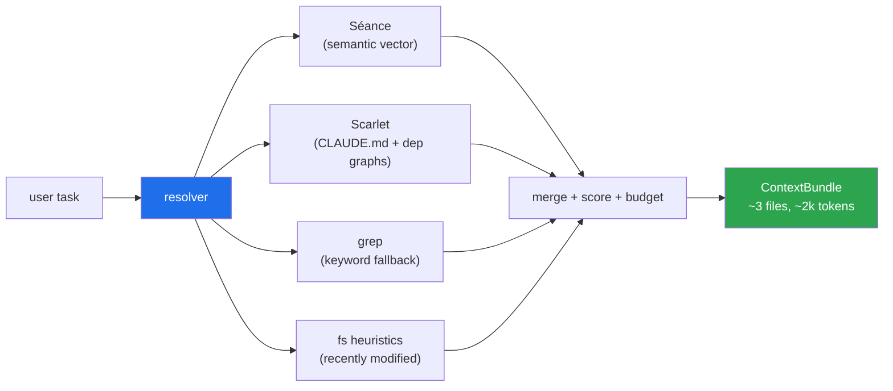

When Séance/Scarlet aren't installed, the resolver falls back to grep + fs heuristics. **Quality scales with what's available; the interface doesn't change.**

### Pillar 2 — Runtime manager

`khimaira dev` is the demoable wow-moment.

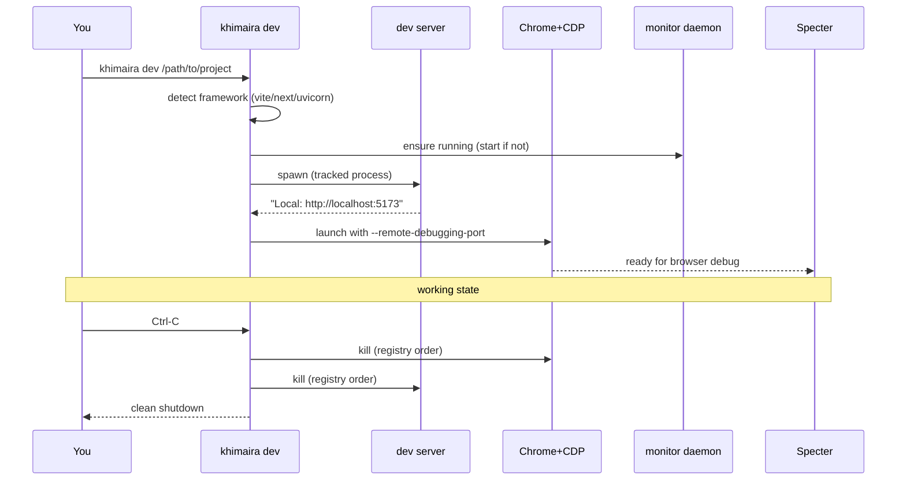

Without `khimaira dev`, the same setup is 4-5 manual commands and orphaned processes when something crashes.

### Pillar 3 — AI dispatcher (AMR — automatic model router)

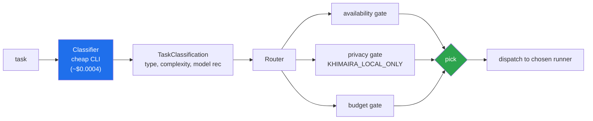

The router picks among installed runners using a YAML routing table that ships with sensible defaults (overridable per-user / per-project).

---

## LangGraph observability

`khimaira attach <app-path>` injects a zero-touch observer into any Python project's venv. No source changes, no env vars, no installed deps in the app's manifest. Restart the app and every LangGraph node, every LLM call, every external HTTP request streams to khimaira-monitor in real time.

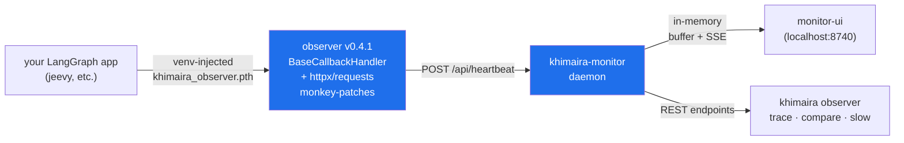

### What you get out-of-box

| Surface | What it shows |
|---|---|
| `/{project}/topology` | Live LangGraph node-by-node execution + replay |
| `/{project}/cost` | Estimated USD spend by model, token counts, telemetry-overhead callout (LangSmith calls — opt out via `KHIMAIRA_DISABLE_LANGSMITH=true`) |
| `/{project}/trace/{cid}` | Waterfall view of one app run — chain/llm/tool/external bars on a time axis. The *exact* visualization that proves your `asyncio.gather` is actually concurrent (3 starts within ~10ms = textbook parallel) |
| `khimaira observer trace <p> <cid>` | Full event timeline as text |
| `khimaira observer compare <p> <cid-a> <cid-b>` | A/B per-node wall-time deltas with regression markers |
| `khimaira observer slow <p> --llm 5 --external 30` | Recent calls past per-kind threshold + in-flight stuck detection |

### Auto-correlation (zero app code changes)

Every event the observer emits gets auto-tagged with the LangGraph run's top-level `correlation_id`:

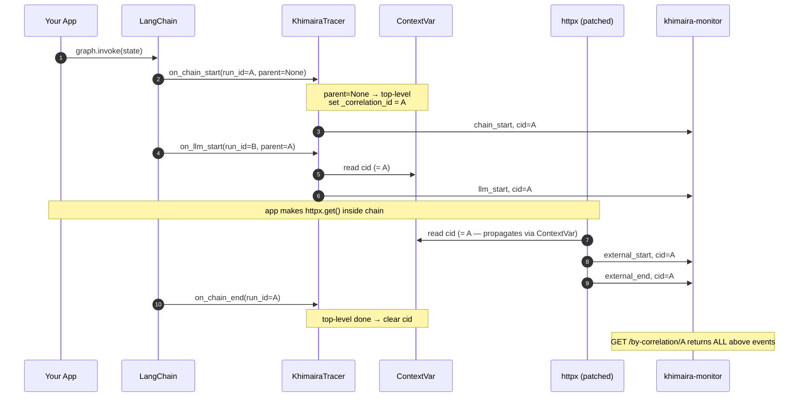

```python
# Your app — UNCHANGED:
result = graph.invoke(state)
# Now queryable: GET /api/heartbeats/<project>/by-correlation/<run_id>
# returns every chain/llm/tool/external event for this run
```

The observer reads LangChain's `parent_run_id=None` signal on `on_chain_start`, sets a `ContextVar`, and `_enqueue` propagates it through async + thread boundaries to every downstream event including the HTTP monkey-patch interceptors. Override with `khimaira_observer.tag_run(my_id)` only when you want a domain-specific identifier (deliverable_id, business txn id) instead of the auto UUID.

### attach / detach

```bash
khimaira attach /path/to/your/langgraph/app
# drops khimaira_observer.pth + khimaira_observer/ into the venv's site-packages
# (gitignored — production builds don't include them)

khimaira attached
# list all attached projects + observer version per venv

khimaira detach /path/to/your/langgraph/app
```

The observer fails silent on every error path — apps must not break because of telemetry setup.

---

## Multi-session shared state

When one Claude Code session is grinding on a task, you can't ask related questions in another window without losing context. Khimaira externalizes session state so parallel sessions can collaborate — and so future sessions can pick up where stopped ones left off.

### Cross-session messaging — five primitives

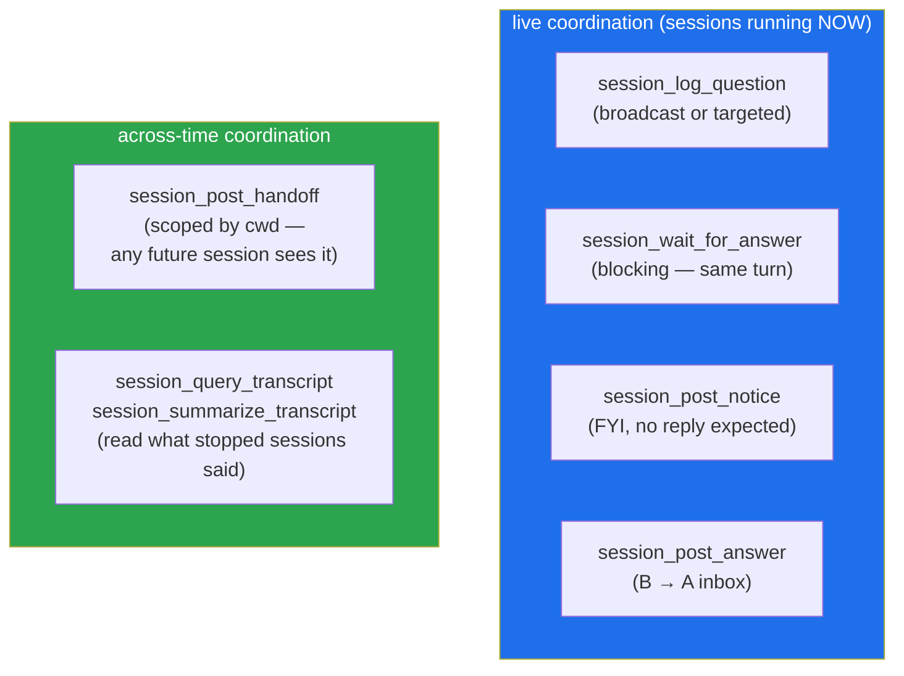

| When you want to... | Use |
|---|---|
| Ask another *active* session a question, get answer in the same turn | `session_log_question(target_session_id=B)` + `session_wait_for_answer(qid)` |
| Tell another session "FYI, no reply needed" | `session_post_notice(target_session_id=B, text=...)` |
| Leave a note for **whoever opens the next chat in this project** | `session_post_handoff(text=..., scope_cwd=...)` — auto-surfaces on any future session's SessionStart hook in matching cwd |
| Read what a stopped session discussed about topic X | `session_query_transcript(session_id, query="X")` |
| Get the lay of the land of a stopped session before drilling in | `session_summarize_transcript(session_id, focus="X")` — heuristic, no LLM cost |
| Search past inbox notes (drained / acked / auto-expired) | `session_search_archive(session_id, query)` |

### Hooks (auto-surfacing — no manual polling required)

Two hooks ship with khimaira and install via `khimaira install-hooks`:

- **SessionStart** — auto-reads inbox + matched handoffs + lists other active sessions
- **UserPromptSubmit** — auto-fetches inbox notes (with surface-count + 3-turn auto-expire) AND incoming questions targeting this session, injects both into context every turn

You never manually call `session_pending_notes` mid-conversation; the loop is closed structurally.

### Example — real-time cross-session ask

```python
# Session A, mid-turn:
qid = session_log_question(
    session_id=ME,
    text="Roboflow per-page parallelization look right?",
    target_session_id="llm-piping-extension",  # routes to B's hook
)
answer = session_wait_for_answer(ME, qid, timeout=300)
# → A blocks. B's UserPromptSubmit hook surfaces the question on B's
#   next turn. B answers via session_post_answer. A unblocks instantly
#   and continues processing in the SAME turn.
```

### Example — real-time wait_for_answer flow

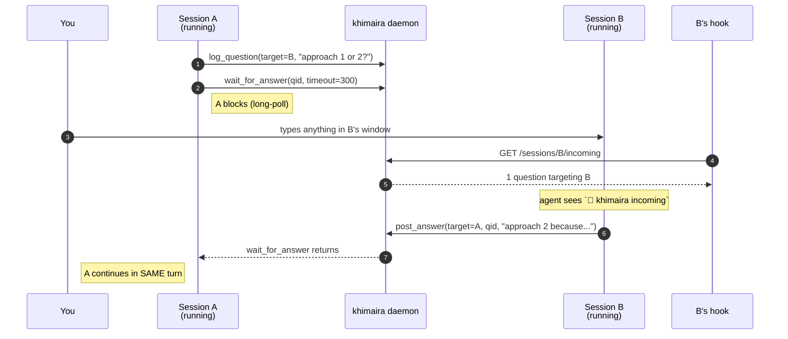

User effort: 1 prompt to A (kicks off ask + wait), 1 prompt to B (B answers), A continues automatically. **No copy-paste relay, no cross-window context juggling.**

### Example — handoff to a future session

```python
session_post_handoff(
    from_session_id=ME,
    text="HANDOFF: shipped tasks #58-#65 + observer v0.4.1. Pickup
          tasks/workspaces/IMPLEMENTATION.md if you want workspace
          isolation. Restart jeevy backend to get auto-correlation.",
    scope_cwd="/home/_3ntropy/dev/khimaira",
)
```

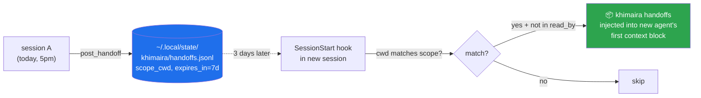

### Reading what stopped sessions said

Claude can't be programmatically resumed — but the conversation transcripts are on disk at `~/.claude/projects/<project>/<uuid>.jsonl`. Two tools turn that into queryable knowledge:

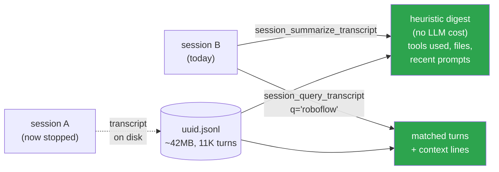

No new LLM API calls from khimaira daemon — the agent calling the tool can summarize via its own context if it wants to.

---

## Process observability — replace polling with one blocking call

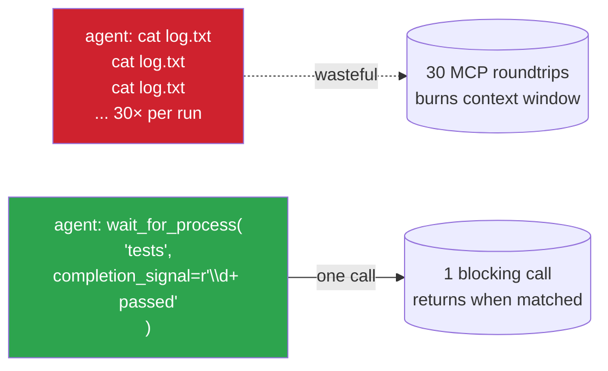

The khimaira daemon tails the process internally; the agent makes one blocking MCP call. Single roundtrip replaces dozens of polls.

---

## Status & roadmap

See [`tasks/BUILD-PLAN.md`](tasks/BUILD-PLAN.md) for full status. Cliff-notes:

| Phase | Status |
|---|---|
| 0 — Monorepo scaffold | ✅ |
| 1 — Shared types | ✅ |
| 2 — CLI runners (pure-CLI substrate) | ✅ |
| 3 — AMR (auto model router) | ✅ |
| 4 — Context resolver (with grep/fs fallbacks) | ✅ |
| 5 — `khimaira dev` runtime manager | ✅ |
| 6 — `khimaira task/route/doctor/monitor/mcp/dev` CLI | ✅ |
| 7 — Monitor daemon migration | ✅ |
| 8 — All 8 LangGraph patterns migrated | ✅ |
| 9 — Frontend (`apps/monitor-ui`) | ✅ |
| 10 — API removal (langchain_anthropic deprecated) | ✅ |
| 11 — Multi-session shared state | ✅ |
| 12 — Process observability | ✅ |
| 13 — MCP call telemetry | ✅ |
| 14 — Venv-injected observer (zero-touch LangGraph tracing) | ✅ v0.4.1 |
| 14b — Observer dashboards (cost / trace waterfall / slow alerts) | ✅ |
| 14c — Hooks for cross-session inbox + incoming + handoffs auto-surface | ✅ |
| 14d — Cross-session primitives (targeted Q, wait_for_answer, post_notice, post_handoff, archive, transcript query/summary) | ✅ |
| 4½ — Séance/Scarlet library APIs | ⬜ |
| Workspaces (multi-project session isolation) | ⬜ spec'd at `tasks/workspaces/` |
| Desktop notifications (libnotify push for cross-session events) | ⬜ spec'd at `tasks/desktop-notifications/` |
| React DevTools replacement (Vue-DevTools-quality UI for React) | ⬜ spec'd at `tasks/react-devtools/` |
| Burn-down savings dashboard widget | ⬜ |

---

## Status

Pre-alpha. Active development. Legacy version archived at [`fsocietydisobey/khimaira-legacy`](https://github.com/fsocietydisobey/khimaira-legacy) for historical reference.
