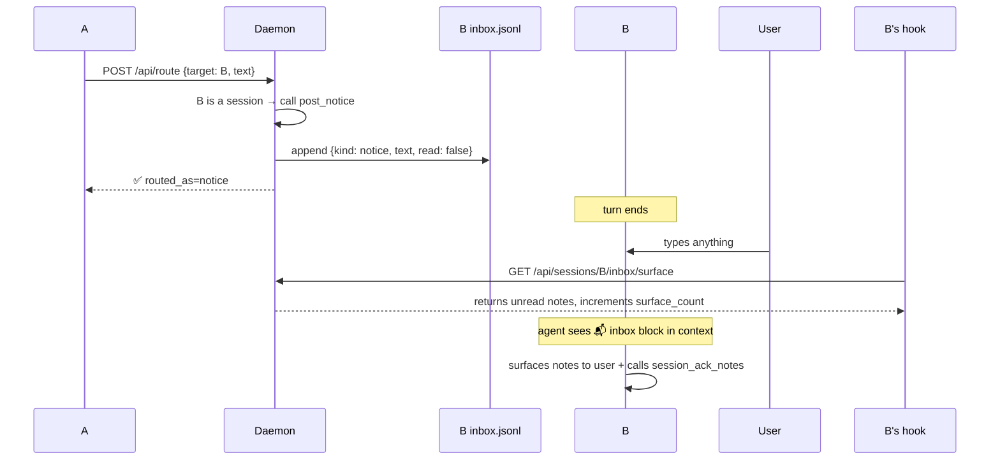
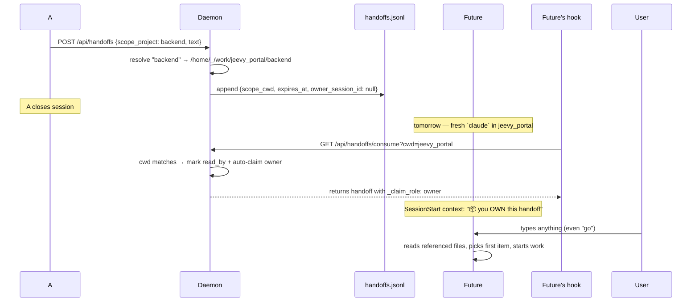
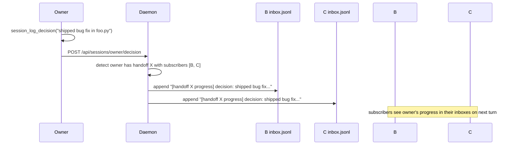

# Inbox + Handoffs — khimaira's cross-session message system

> Reference for the cross-session coordination primitives: what they are,
> how data flows on disk, which slash command + MCP tool maps to which
> intent. If you're picking up khimaira for the first time, **start here**.

## TL;DR

| Intent | Slash | Underlying primitive |
|---|---|---|
| Tell a known live session a one-way FYI | `/tell <name> <msg>` | `session_post_notice` |
| Tell ANY future session in a project | `/tell <project> <msg>` | `session_post_handoff` (smart-routed) |
| Ask a session, need answer this turn | `/ask <name> <q>` | `log_question + wait_for_answer` |
| Leave directive for next chat in project | `/handoff <project> <msg>` | `session_post_handoff` |
| Read your own inbox | `/inbox` (or auto-injected) | `session_pending_notes` |
| Read another session's state | `/notes <name>` | `session_state` |
| Find what a stopped session said | `session_query_transcript(name, q)` (MCP) | grep on-disk JSONL |
| Subscribe to a handoff owner's progress | `session_subscribe_handoff(id, me)` | adds you to subscribers |
| Owner releases work | `session_release_handoff(id, me)` | clears owner; next claim wins |
| Owner delegates a slice to a specific session | `session_invite_handoff(parent_id, me, invitee, text)` | child handoff scoped to invitee |

If you only learn three: **`/tell`** (send to anyone/anywhere), **`/handoff`** (future session), **`/inbox`** (read).

---

## Mental model — email + Slack + GitHub issues, all very small

```
Each session has an INBOX file on disk        ← Gmail data model
Each project has a SHARED HANDOFF QUEUE       ← Slack channel
Each handoff has an OWNER + SUBSCRIBERS       ← GitHub issue assignee + watchers
```

When you SEND, you don't pick the storage layer — you state intent
(`/tell` / `/handoff` / `/ask`) and the daemon routes to the right file.

When you RECEIVE, you don't poll — your **UserPromptSubmit hook**
auto-fetches inbox + incoming-question + handoff content on every
prompt and injects it into your context. The agent sees it; the agent
acts.

---

## Storage layout

```
~/.local/state/khimaira/
├── sessions/<session-uuid>/
│   ├── status.json         ← your session name (set via /rename or session_set_name)
│   ├── inbox.jsonl         ← unread notices + answers (your "Gmail")
│   ├── archive.jsonl       ← past read notes (grep-able via session_search_archive)
│   ├── questions.jsonl     ← questions YOU asked + their answers
│   ├── decisions.jsonl     ← your own commitments (pull-only via session_state)
│   └── files_touched.jsonl ← auto-logged by PostToolUse hook
└── handoffs.jsonl          ← cross-session, cwd-scoped, owner + subscribers
```

The daemon serves these via `/api/sessions/*` and `/api/handoffs/*`.

---

## Lifecycle: how a message lands

### One-way notice (`/tell <session>`)



Notes re-surface up to 3 turns if not ack'd, then auto-expire (safety
net against silent-consumption).

### Handoff (`/handoff <project>`) — for FUTURE sessions



If another session boots in the same cwd while owner is mid-work,
THAT session sees `_claim_role: observer` + the option to subscribe.

### Subscribe — collaboration on an owned handoff



---

## Decision tree — which primitive

```
Do you need a reply back?
├── YES, in this turn        → /ask  (blocking)
├── YES, eventually          → session_log_question(target=...) without wait
└── NO
    ├── Target session exists right now
    │   ├── Single recipient                  → /tell <session> (smart router resolves)
    │   └── (no multi-recipient broadcast primitive — use handoff if project-scoped)
    └── Target doesn't exist yet (future session)
        ├── Single project → /handoff <project>
        └── Specific cwd path → /handoff /path/to/dir
```

When in doubt: `/tell` smart-routes between session and project automatically; use it.

---

## Handoff collaboration roles

```
First session to consume an unclaimed handoff:
    → claim_role: OWNER
    → SessionStart directive: "you are PRIMARY. Read specs, propose first action, START."

Subsequent sessions in same cwd consuming:
    → claim_role: OBSERVER
    → SessionStart directive: "claimed by <owner>. Options:
       • subscribe to receive owner's progress
       • read owner's state via session_state(<owner>)
       • send owner a notice if you spot something
       • stand down + work on something else
      Default: stand down. Don't duplicate the owner's work."

Owner finishes or steps aside:
    → session_release_handoff(id, owner_session_id)
    → owner field cleared; next consume claims as new owner

Owner delegates a slice to a specific session:
    → session_invite_handoff(parent_id, me, invitee, text)
    → creates a CHILD handoff with parent_id + target_session_id
    → invitee gets inbox notice immediately (if live)
    → AND surfaces on invitee's next SessionStart hook with INVITE framing
    → cwd-peers skip it — invite is 1:1 by construction

Subscribers stay subscribed across owner changes.
```

---

## Reliability semantics

**Inbox notes (`post_notice`, `post_answer`):**
- Surface up to **3 times** on the receiver's hook, then auto-expire
- Receiver should call `session_ack_notes` after surfacing to clear
- After expire / ack: moved to `archive.jsonl`, queryable via `session_search_archive`
- Survives daemon restart (file-backed)
- Does NOT survive `~/.local/state/khimaira/sessions/<uuid>/` deletion

**Handoffs:**
- 7-day default expiration (`expires_in_hours=168` override)
- Each session consumes a given handoff exactly **once** (read-by tracking)
- Expired entries cleaned up on next `consume_handoffs` call
- Owner auto-claim is **atomic** — first POST to the consume endpoint wins
- Survives daemon restart (file-backed)

**Questions / answers:**
- Question stays open until answered or withdrawn
- Answer fans out to asker's inbox automatically
- `wait_for_answer` long-polls the daemon (5-min default timeout)

---

## What NOT to do

- **Don't `session_log_question` when you don't need an answer.** Use
  `session_post_notice` (FYI) or `session_post_handoff` (for future).
  Questions create a ping-pong burden if no answer is needed.
- **Don't pass cwd paths to `/tell` / `/handoff`.** Use project labels
  (`khimaira attached` to see them). Paths are mechanism; labels are intent.
- **Don't poll `session_pending_notes` in a loop.** The hook auto-injects
  on every prompt; manual `/inbox` is for explicit drain.
- **Don't ignore handoff owner status.** If `_claim_role` is `observer`,
  default to standing down. Owner does the work; you observe / help / wait.

---

## Anti-patterns we've shipped fixes for

| Pattern | Fix |
|---|---|
| Daemon died, everything silently breaks | `khimaira monitor install-service --enable` (systemd) |
| Stale session-name lookup after `/rename` | UserPromptSubmit hook auto-syncs Claude Code's custom-title to khimaira |
| Agent reads handoff as "informational note", waits for user | SessionStart hook explicitly framed as directive |
| Two sessions in same cwd both try to act on same handoff | First-consume auto-claim + observer framing for subsequent |
| MCP `_get` masked HTTP 4xx/5xx as "daemon down" | Differentiates HTTPError from ConnectionRefused |
| `session_pending_notes` formatter dropped notice body | Handles notice-kind separately from answer-kind |
| 500 instead of 404 on unknown session name | 5 endpoints wrapped in try/except → HTTPException(404) |
| Inbox notes accumulated forever after read | Moved to `archive.jsonl` on ack; queryable via `session_search_archive` |

These are all in `CLAUDE.md` (workspace root) as engineering rules so they
don't recur.

---

## Pointers

| What | Where |
|---|---|
| Full MCP tool list | `khimaira tools --category mcp` or `/tools` |
| Slash command source | `~/.claude/commands/*.md` (symlinked from dotfiles) |
| Hooks | `scripts/hooks/{session_start,user_prompt_submit,post_tool_use}.py` |
| Daemon code | `packages/khimaira/src/khimaira/monitor/sessions.py` |
| Engineering rules | `CLAUDE.md` (workspace root) |
| Tests demonstrating semantics | `packages/khimaira/tests/test_sessions_unit.py` |
