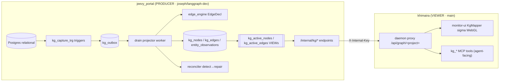

# KG System Tracker — jeevy producer ↔ khimaira viewer

> **Living status doc.** The knowledge-graph system spans two repos: jeevy_portal
> *produces* the graph (relational DB → KG), khimaira *visualizes + audits* it
> (code-agnostic viewer + agent tools). This doc is the single place to track where
> both halves stand. **Update the Status Matrix + Changelog as work lands.**

- **Last updated:** 2026-06-28 (khimaira-master, from two deep-read agents + live verification)
- **khimaira side:** branch `main` (KG mapper viewer + `kg_*` tools)
- **jeevy side:** branch `joseph/langgraph-dev` (`/internal/kg` producer; owned by jeevy/livyatan sessions)
- **Related:** [#38 KG debugging tiers], [#39 verdict-starvation] (separate), `ESCAPED-BUGS-LOG.md` corpus

---

## 0. TL;DR / status at a glance

- **The viewer (khimaira) is shipped through P0–P3 and LIVE-VERIFIED end-to-end today** against jeevy shop:10. Generic contract + daemon proxy + sigma WebGL UI + 9 `kg_*` agent tools (6 instance + 3 aggregate).
- **The producer (jeevy) has all consumed endpoints shipped** (`/internal/kg/graph|node|edge|schema|health|coverage|edges-audit`), plus the capture→drain→project→reconcile pipeline, capture-denylist gate, reproject tool, and chat-retrieval (traverse→hydrate).
- **⚠️ Live access gotcha:** the jeevy KG is attached to the khimaira daemon under project label **`backend`** (not `jeevy`). All `kg_*` tool calls must use `project="backend"`, `scope="shop:<id>"`. Calling `project="jeevy"` returns a misleading `404 no KG adapter registered`.
- **⚠️ Security gotcha (both sides agree):** jeevy's `verify_internal_key` **fails OPEN** when `INTERNAL_API_KEY` is unset → `/internal/kg/*` is effectively unauthenticated. The same secret must be provisioned on BOTH the khimaira daemon env and jeevy in every deployed environment.
- **Open data-quality signal:** shop:10 currently shows 416/1000 orphan nodes (177 task, 163 job) + 300 dangling edges despite 100% containment — worth a jeevy-side look (see §6).

---

## 1. Architecture — one system, two repos



**Producer pipeline (jeevy):** CDC trigger → outbox → drain projector → derived graph
VIEWs → `/internal/kg` endpoints. The drain worker (`projector_worker.py:196`) is the
**only** active projection loop; it reads `kg_outbox` in strict sequence order, projects
each row (`kg_outbox_projector.py:78`), advances a crash-safe cursor, and runs a reconcile
sweep on the batch tail. `kg_active_nodes` / `kg_active_edges` are Postgres VIEWs (trust-
lattice recency + NOT-EXISTS tombstone exclusion in SQL).

**Viewer stack (khimaira):** three code-agnostic layers — UI (`monitor-ui`) → same-origin
`/api` proxy → daemon `/api/graph/<project>` (`monitor/api/graph.py`) → project's
`/internal/kg` adapter. The daemon never interprets jeevy's schema; it forwards opaque
`scope`/`since` verbatim and renders whatever conforms to the generic contract.

---

## 2. The contract (the seam between the two halves)

This is the khimaira-OWNED generic schema. Any project that implements it gets a graph
view for free. **Zero jeevy terms** — `type` is an opaque string, never `node_type` or
`canonical_key`.

**Source of truth:** `apps/monitor-ui/src/components/kg/kgTypes.ts:36-92` +
`tasks/kg-graph-mapper/SPEC.md:137`.

```ts
GraphNode  = { id, type, label, badge? }                 // type opaque → hashed to color
GraphEdge  = { from, to, type, weight?, id? }            // weight 0–1 confidence; id enables provenance drill-in
GraphFact  = { label, value, meta?, deprecated? }        // current (prominent) vs history (dimmed)
NodeDetail = { id, type, label, badge?, currentFacts, historyFacts, edgesFrom, edgesTo }
Schema     = { nodeTypes[], linkTypes[], triples:[{fromType, linkType, toType, count}] }
Envelope   = { data: <contract> }                        // daemon always wraps; UI unwraps
```

**Endpoints the viewer consumes** (jeevy handlers in `backend/api/v1/endpoints/internal.py`):

| Endpoint | jeevy handler | khimaira proxy route | Returns |
|---|---|---|---|
| `/internal/kg/graph` | `internal.py:260` | `/api/graph/<p>` | whole-shop `{nodes,edges}`, topology only (no financial values), caps 10k w/ `truncated` flag |
| `/internal/kg/node/{id}` | `internal.py:334` | `/api/graph/<p>/node/<id>` | current/history facts + incident edges; unknown → `found:false`, not 404 |
| `/internal/kg/edge/{id}` | `internal.py:493` | `/api/graph/<p>/edge/<id>` | edge provenance folded into opaque `meta` (match_method, source_doc, page, bbox, confidence…) |
| `/internal/kg/schema` | `internal.py:541` | `/api/graph/<p>/schema` | type meta-graph (nodeTypes, linkTypes, occurring triples + counts) |
| `/internal/kg/health` | `internal.py:616` | `/api/graph/<p>/health` | node counts by type + orphans + dangling edges + containment coverage |
| `/internal/kg/coverage` | `internal.py:655` | `/api/graph/<p>/coverage` | relational-rows vs KG-nodes ratio per entity (under-projection detector) |
| `/internal/kg/edges-audit` | `internal.py:693` | `/api/graph/<p>/edges-audit` | match-method histogram + confidence buckets + shaky tail |

**Auth:** per-adapter header (jeevy uses `X-Internal-Key`). **Fails OPEN if `INTERNAL_API_KEY`
unset** (`internal.py:227-230`) — see §7 risks.

**Financial gating:** only `unit_price` facts, dropped unless `shop.security_class=='financial'`
(`internal.py:331`).

> **Contract note (stale-schema flag):** jeevy's `backend/schemas/kg_audit.py` Pydantic
> models (`KgHealthResponse` etc.) are **imported nowhere** and have a *different* shape than
> what the handlers actually return. The `kg_audit_service.py` dict is the real contract; the
> Pydantic file is aspirational/stale. Don't trust it as the schema.

---

## 3. Producer half (jeevy) — subsystems

- **Capture-denylist gate (JEEVY-665 / 677-L2)** — `capture_denylist.py`. Promotes a behavioral
  "don't capture secrets" rule to a structural CI gate: table globs (`auth.*`, `vault.*`,
  `storage.*`) must NOT carry a `kg_capture_trg`; column globs (`*password*`, `*token*`,
  `*secret*`, `*_hash`, `*_key`…) must NOT appear in any spec allowlist. Stops password
  hashes / session tokens streaming into `kg_outbox`.
- **Reconciler / detect→repair (JEEVY-673)** — `reconciler.py`. Inline-persist at detection
  (UPSERT `kg_projection_gaps` status=`open` before cursor advances → durable on crash) +
  post-drain sweep re-attempts each open gap. **Resolve-only-on-success** (anti-masking):
  a gap closes only when the output actually resolves; retry budget K=3 → `tier=degenerate,
  status=stuck` (loud, queryable, survives restarts).
- **Edge-projection fix + reproject (JEEVY-676 / 674)** — commit `15f8f2ad`. **676** routing-head
  guard: `op=='insert'` routes straight to `_project_all_surfaces`, bypassing changed-keyed
  fast paths (`kg_outbox_projector.py:137`) — closes the class where a null pre_image misrouted
  an insert to the reparent fast-path → 0 edges. **674** `reproject_shop_kg` (`reproject.py:73`):
  shop-scoped rebuild (snapshot deprecations → truncate → replay anchors-first → re-key spared
  deprecations). Live witness shop:10: project-led `owns` 0→181, orphans 211→0.
- **Chat-retrieval (traverse→hydrate, JEEVY-661/662/666)** — `kg_traverse` bounded cycle-guarded
  recursive-CTE walk (≤5 depth) → `hydrate_neighborhood` two-leg traverse + relational hydration
  → a pre-answer GraphRAG node that runs **deterministically before the LLM speaks**, augments the
  system prompt, and emits a structured `retrieval_sources` SSE event (panel renders from this,
  not LLM self-citations). Fail-open throughout.
- **`kg_tracked_surface_columns.json`** — auto-generated schema snapshot (do-not-hand-edit) of
  the 16 captured surfaces + FK anchors + soft-delete candidates. Two regen tools:
  `regen_kg_schema_snapshot.py` (dumps from live DB `information_schema`) and
  `gen_kg_capture_triggers.py` (keeps spec ↔ migration SQL in parity without a DB; pre-commit +
  `test_kg_capture_trigger_sql_parity.py`). Last regenerated at `3237b2a7`.

---

## 4. Viewer half (khimaira) — `kg_*` agent tools

Agent-facing debugging surface (roster agents have no DB access). All forward opaque
`scope`/`since` verbatim; types stay opaque.

| Tool | Purpose |
|---|---|
| `kg_graph` | orientation: counts + type histograms + node sample (grab opaque ids) |
| `kg_node` | one node's full detail — current/history facts + all incident edges |
| `kg_edge` | "why does this edge exist?" — match_method, source_doc/page/bbox, confidence |
| `kg_schema` | type meta-graph — an ABSENT triple = extractor never produced it (structural-gap finder) |
| `kg_search` | id resolver — find node_id by label/id, ranked exact→prefix→substring |
| `kg_view_url` | deep-link to the visual viewer + Specter screenshot recipe |
| `kg_health` | per-type counts + orphans (degree-0) + dangling edges + containment coverage |
| `kg_coverage` | relational-vs-KG ratio per entity — under-projection detector |
| `kg_edges_audit` | match-method + confidence histograms + suspect tail (no silent truncation) |

Tools in `server/mcp.py:2580-2777` + `server/monitor_tools.py:1830+`; tests
`tests/test_kg_mcp_tools.py` (46 cases). Daemon proxy `monitor/api/graph.py:161-225`.

---

## 5. Status matrix

| Item | Side | Status | Evidence |
|---|---|---|---|
| Generic contract (kgTypes.ts) | khimaira | ✅ Live | `kgTypes.ts:36-92` |
| Daemon proxy routes | khimaira | ✅ Live | `graph.py:161-225` |
| KgMapper UI (sigma WebGL) | khimaira | ✅ Live | `KgMapper.tsx`; e2e shop:10 |
| `kg_*` instance tools (graph/node/edge/schema/search/view_url) | khimaira | ✅ Live | `0df3ac1`; 46 tests |
| `kg_*` aggregate tools (health/coverage/edges-audit) | khimaira | ✅ Live-verified | live `kg_health backend shop:10` 2026-06-28 |
| `/internal/kg` instance endpoints | jeevy | ✅ Shipped | `9b167cb6`; `internal.py` |
| `/internal/kg` aggregate endpoints | jeevy | ✅ Shipped | `9b167cb6`; `kg_audit_service.py` |
| Capture pipeline (trigger→outbox→drain) | jeevy | ✅ Shipped | `projector_worker.py` |
| Reconciler detect→repair (673) | jeevy | ✅ Committed | `ead5c4c4` |
| Capture-denylist gate (665/677-L2) | jeevy | ✅ Committed | `ead5c4c4` |
| Edge-fix + reproject (676/674) | jeevy | ✅ Committed + live-witnessed | `15f8f2ad` |
| Chat-retrieval (661/662/666) | jeevy | ✅ Committed | `ac520a3c`, `fe1d5f96` |
| **#38 Tier-2 contract-gate (test)** | khimaira | 🟡 Built, uncommitted | `test_kg_contract_gate.py`, 11 green (void-1, 2026-06-28) |
| **#38 Tier-2 live tollgate (wire validator into get_graph)** | khimaira | ⏸️ Deploy-gated | daemon change; held behind §5 deploy gate |
| LOD / scale for dense shops (v2) | both | ⏳ Backlog | JEEVY-661/663; deferred |
| Ontology scanner (kg-scanner) | khimaira | 📋 Spec'd, not built | `tasks/jeevy-kg-scanner/SPEC.md`, `e3f5772` |
| `intrinsic\|contextual` scope-class gate | jeevy | ⏳ Open (blocks 586 read-cutover) | JEEVY-611/609 §5 |

---

## 6. Live verification (2026-06-28)

`kg_health(project="backend", scope="shop:10")` → **HTTP 200**, end-to-end path confirmed:

- **1000 nodes · 1000 edges · 416 orphans (degree-0) · 300 dangling edges**
- Node types: task ×281 (177 orphan) · job ×263 (163 orphan) · part ×76 (67 orphan) ·
  bom-line ×315 (0 orphan) · workstream ×23 · line_item ×20 · part_type ×8 · organization ×7 ·
  user ×4 · vendor ×2 · shop ×1
- Link types: contains ×649, created-by ×136, quotes ×99, belongs-to ×92, subtask-of ×10,
  supplies ×6, has-type ×3, depends-on ×2, for-part ×2, has-document-type ×1
- Containment: workstream/bom-line/line_item → job all **100%** have a parent

**Observation (not yet diagnosed):** high orphan rate on `task` (177/281) and `job` (163/263)
plus 300 dangling edges, despite 100% containment for the projected child types. The reproject
witness for shop:10 reported orphans 211→0 for *project-led jobs* — this is a different/wider
cut. Flag for jeevy-side attention; do NOT diagnose from here. (Also note totals are a round
1000/1000 — confirm whether that's a health-endpoint sample cap vs the true graph size.)

---

## 7. Risks & gotchas (carry forward)

1. **Auth fails OPEN** — `verify_internal_key` (`internal.py:227-230`) bypasses auth when
   `INTERNAL_API_KEY` is unset. `/internal/kg/*` exposes the whole graph unauthenticated in any
   env missing the secret. **Provision the same key on daemon + jeevy everywhere.** Both deep-reads
   independently flagged this — treat as the top deploy risk.
2. **Project label is `backend`, not `jeevy`** — all `kg_*` calls + viewer URLs use `project="backend"`.
   The 404 message ("no KG adapter registered for project X") is misleading when the real cause is a
   wrong project name. Adapter URL: `http://127.0.0.1:8000/api/v1/internal/kg/graph` (attached.json).
3. **Stale Pydantic schema** (`backend/schemas/kg_audit.py`) — imported nowhere, wrong shape; the
   service dict is the real contract.
4. **jeevy `STATE.md` self-inconsistency** — its "Done" table says the 673 batch committed at
   `ead5c4c4` (✅ confirmed via `git show`), but its issue-status table says 673 is "ON HOLD". The
   ON-HOLD row is stale. Routed to jeevy-master.

---

## 8. Escaped-bugs corpus (cross-link)

The KG projection is the origin of the **escaped-bugs initiative** (`ESCAPED-BUGS-LOG.md` in
jeevy_portal/shared-docs). **Meta-class:** *green unit suite, broken live behavior — the bug lives
in an INTEGRATION SEAM the unit tests mock past.* It's **recursive** (a catching-test can itself
escape via a different seam — the L2 real-DB test that `import psycopg2` on a psycopg-v3 codebase
→ ImportError → skip → vacuous). **Standing invariant: a skip is not a pass** — assert
`executed>0`, not `failures==0`. Forward test strategy is layered L0 (assert-it-runs) → L1
(real-producer→projector) → L2 (real-DB SQL) → L3 (schema-contract vs `information_schema`) → L4
(Specter-in-CI). 8 seed bugs + ~10 later appends; see the log for the full table. void-1's #38
contract-gate test is built to this discipline (a missing `kgTypes.ts` FAILS, never skips).

---

## 9. Open items / next actions

- [ ] **#38 Tier-2 live tollgate** — void-1 to draft the staged diff wiring the contract validator
      into `graph.get_graph` (deploy-gated; bundle with the next daemon restart). **Default to
      fail-SAFE** (serve conforming nodes + log/annotate nonconforming) rather than hard-502 the
      whole payload, so a benign contract drift degrades gracefully (per default-toward-recoverable).
- [ ] **Bundle the next deploy window** — #39 commit + #38 live tollgate + any P3 follow-ups should
      ride one daemon restart (livyatan is live; §5 gate). Master coordinates the window with Joseph.
- [ ] **jeevy-side:** investigate shop:10 orphan/dangling rate (§6); confirm the 1000/1000 cap.
- [ ] **jeevy-master:** reconcile `STATE.md` 673 status (Done vs ON-HOLD rows).
- [ ] **Future:** ontology scanner (structure view, separate from this instance viewer); LOD for
      dense shops (JEEVY-661/663, deferred).

---

## 10. Changelog

- **2026-06-28** — Tracker created (khimaira-master). Mapped both halves via two deep-read agents;
  live-verified the viewer↔producer path end-to-end (`kg_health backend shop:10` → 200). Recorded
  the `project="backend"` label gotcha + the auth-fail-open risk. void-1 built the #38 Tier-2
  contract-gate test (11 green, uncommitted).
