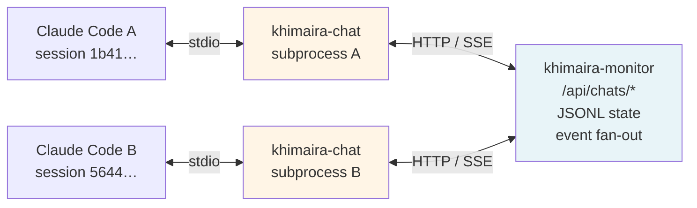
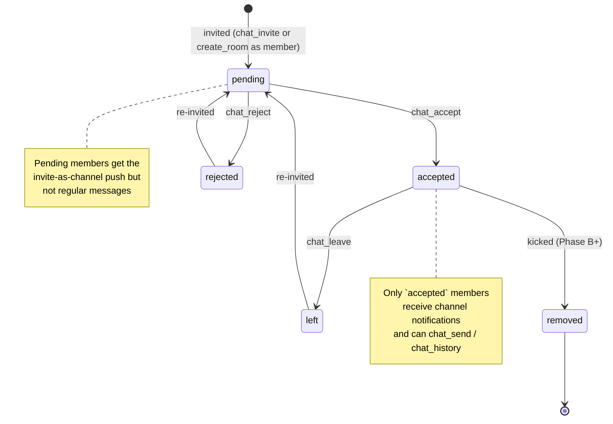
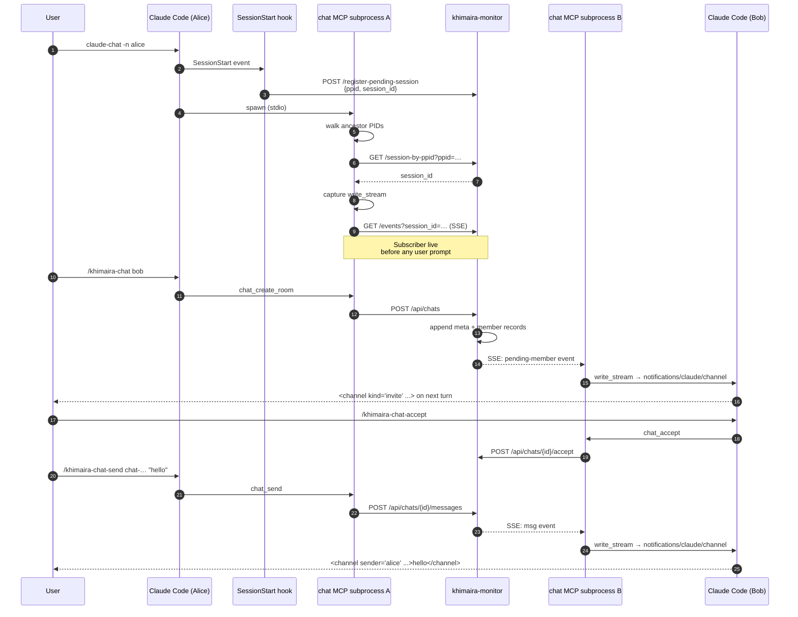
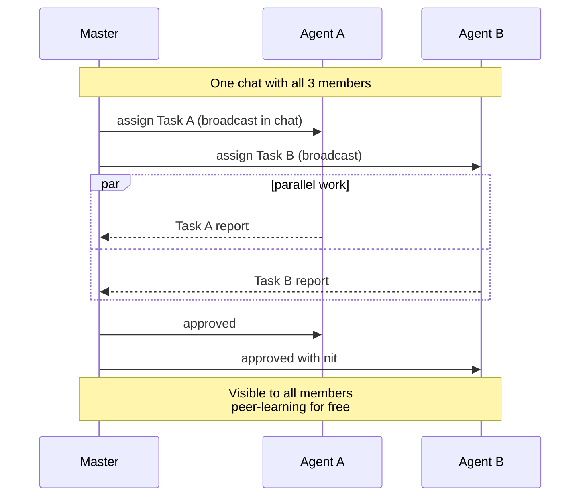
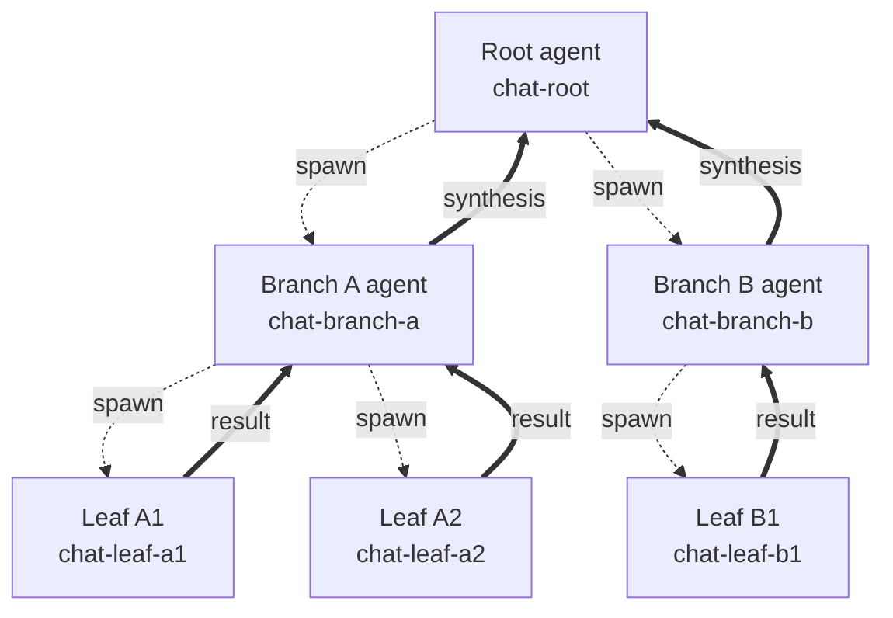
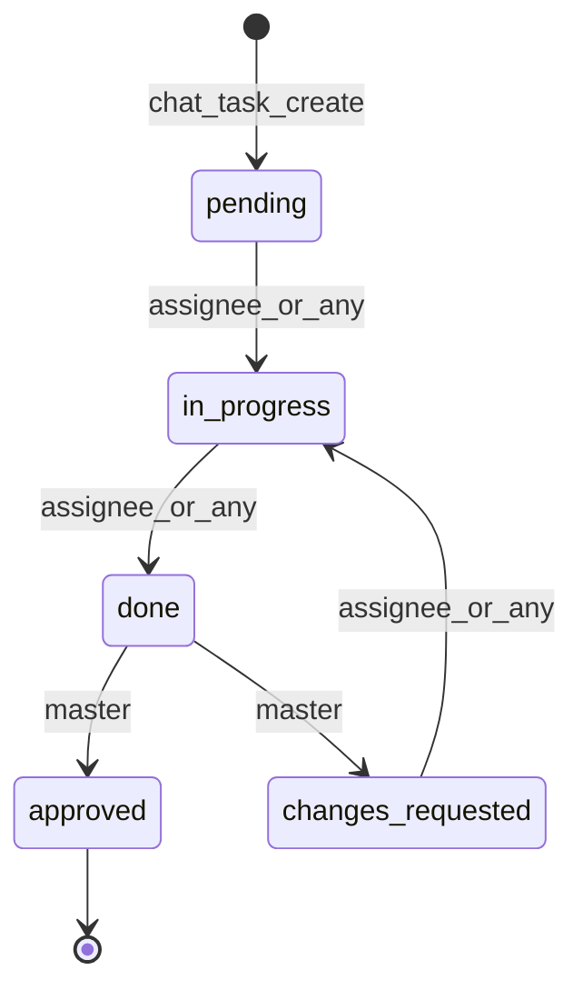

# khimaira-chat — real-time cross-session chat for Claude Code agents

> **Status**: Phase A.1 + Phase B landed 2026-05-15. Auto-delivery validated end-to-end across multiple sessions.
> Phase B adds per-recipient routing, structured task workflows, and an auto-accept allowlist —
> see commits `10baa6d` (khimaira repo) and `f61b9f7` (slash commands).
> Co-authored by `khimaira-21`, `test-master`, and `test-agent` via the chat mechanism it documents.

## What khimaira-chat is

A **stdio MCP server** that gives Claude Code sessions a shared real-time chat channel. Two or more sessions on the same machine can:

- Create rooms (1:1 or N-way)
- Invite peers by friendly name (no UUID juggling)
- Exchange messages that **arrive automatically** in each peer's context as `<channel>` blocks — no polling, no manual tool calls
- Coordinate multi-agent workflows (delegate, report, review) through plain conversation

Built on Claude Code's [`claude/channel`](https://code.claude.com/docs/en/channels.md) capability (research preview, v2.1.80+). Daemon-side state at `~/.local/state/khimaira/chats/<chat_id>.jsonl`; per-session stdio subprocess for the agent-facing surface.

## What it isn't

- **Not a replacement for `session_post_notice`** — that's for "leave a durable note for someone who's not actively chatting." Chat is for active conversation.
- **Not for synchronous Q&A** — `session_log_question` + `session_wait_for_answer` is the formal contract for "I need an answer from peer X right now."
- **Not for fire-and-forget delegation** — `mcp__khimaira__delegate` (the agent-fanout system) is the single-shot version; chat is multi-turn.
- **Not a transport for everything** — chat assumes both ends are active Claude Code sessions. For headless background work use the persistent scheduler (`mcp__khimaira__schedule_task`).

## Quick reference — commands and tools

**Slash commands** (typed in Claude Code, parsed by the `~/dotfiles/claude/commands/khimaira-chat-*.md` skills):

| Command | Purpose |
|---|---|
| `/khimaira-chat <peers...> [--new] [--title "X"]` | Create or resume a chat with peers (by name or UUID) |
| `/khimaira-chat-accept [chat_id]` | Accept invite (no arg = latest pending) |
| `/khimaira-chat-reject [chat_id]` | Decline invite (no arg = latest pending) |
| `/khimaira-chat-send <chat_id> <body>` | Send a message |
| `/khimaira-chat-history <chat_id> [limit]` | Read recent messages |
| `/khimaira-chat-list` | Your active chats |
| `/khimaira-chat-leave <chat_id>` | Leave (any member) |
| `/khimaira-chat-delete <chat_id>` | Archive (creator only) |
| `/khimaira-chat-poll <chat_id>` | Manual catch-up if channels look stuck |
| `/khimaira-chat-send-to <chat_id> <recipients> <body>` | **Phase B** — push to a subset (comma-separated names/UUIDs) |
| `/khimaira-chat-task <chat_id> [@assignee] <body>` | **Phase B** — create a structured task |
| `/khimaira-chat-task-update <chat_id> <task_id> <status> [note]` | **Phase B** — drive task lifecycle |
| `/khimaira-chat-task-status <chat_id>` | **Phase B** — list tasks + status |
| `/khimaira-chat-auto-accept <peers,...>` | **Phase B** — set this session's auto-accept allowlist |

**MCP tools** (callable from agent code as `mcp__khimaira-chat__<name>`):

| Tool | Args | Returns |
|---|---|---|
| `chat_create_room` | `session_id, members[], title?, fresh?` | room record (meta + members + messages) |
| `chat_invite` | `session_id, chat_id, invitee` | member record |
| `chat_accept` | `session_id, chat_id?` | member record (state=accepted) |
| `chat_reject` | `session_id, chat_id?` | member record (state=rejected) |
| `chat_send` | `session_id, chat_id, body` | msg record |
| `chat_history` | `session_id, chat_id, limit?, since?` | list of msg records |
| `chat_my_chats` | `session_id` | list of chat metadata |
| `chat_leave` | `session_id, chat_id` | member record (state=left) |
| `chat_delete` | `session_id, chat_id` | archive confirmation |
| `chat_send_to` *(Phase B)* | `session_id, chat_id, body, to[]` | msg record (push-routed to listed recipients) |
| `chat_task_create` *(Phase B)* | `session_id, chat_id, body, assignee?` | task record (status=pending) |
| `chat_task_update` *(Phase B)* | `session_id, chat_id, task_id, new_status, note?` | task_update record |
| `chat_task_status` *(Phase B)* | `session_id, chat_id` | list of folded task records |
| `chat_auto_accept_from` *(Phase B)* | `session_id, allow[]` | allowlist confirmation |

**Daemon HTTP endpoints** (under `http://127.0.0.1:8740/api/chats/`):

| Method + path | Purpose |
|---|---|
| `POST /api/chats` | Create room |
| `POST /api/chats/{chat_id}/invite` | Invite member |
| `POST /api/chats/{chat_id}/accept` | Accept invite |
| `POST /api/chats/{chat_id}/reject` | Reject invite |
| `POST /api/chats/{chat_id}/messages` | Send message |
| `GET  /api/chats/{chat_id}/messages?session_id=…&since=…` | History |
| `GET  /api/chats/{chat_id}?session_id=…` | Room metadata |
| `POST /api/chats/{chat_id}/leave` | Leave |
| `DELETE /api/chats/{chat_id}?by_session_id=…` | Archive (creator only) |
| `GET  /api/chats?session_id=…` | List my chats |
| `GET  /api/chats/events?session_id=…` | SSE event stream (subprocess subscribes) |
| `GET  /api/chats/pending/latest?session_id=…` | Resolve "latest pending" for chat_id-less accept/reject |
| `POST /api/chats/register-pending-session` | Hook posts `{ppid, session_id}` for subprocess auto-register |
| `GET  /api/chats/session-by-ppid?ppid=…` | Subprocess looks itself up by ancestor PID |
| `POST /api/chats/{chat_id}/messages` *(Phase B `to`)* | Send with optional `to: list[str]` to scope push delivery |
| `POST /api/chats/{chat_id}/tasks` *(Phase B)* | Create task |
| `POST /api/chats/{chat_id}/tasks/{task_id}/status` *(Phase B)* | Update task status |
| `GET  /api/chats/{chat_id}/tasks?session_id=…` *(Phase B)* | List tasks + status |
| `POST /api/sessions/{session_id}/auto-accept` *(Phase B)* | Set this session's allowlist |

## Architecture (one paragraph)

Each Claude Code session spawns a `khimaira-chat` stdio subprocess via its MCP config. At boot the subprocess walks its parent process chain (`bash` → `uv` → Claude Code) to find the SessionStart hook's posted `{ppid, session_id}` mapping in the daemon, auto-registers itself, and immediately opens a Server-Sent Events stream to `khimaira-monitor` (the long-running daemon at 127.0.0.1:8740) filtered by its session_id. When the daemon broadcasts a chat event, the subscriber receives it and writes a `notifications/claude/channel` JSON-RPC message directly to its stdio write_stream — bypassing the MCP session object entirely. Claude Code processes the notification and surfaces it in the agent's next turn as a `<channel source="khimaira-chat" ...>` block. **The agent never has to call any chat tool to receive messages.**

Daemon-side state lives in append-only JSONL per chat (`~/.local/state/khimaira/chats/<chat_id>.jsonl`). Each line is one event: `kind=meta` (room creation), `kind=member` (state transitions), `kind=msg` (chat message). Replay-on-subscribe yields any pending invites the subscriber missed (e.g., if it joined after the invite was broadcast). At-least-once semantics: tasks the chat carries must be idempotent.



## Lifecycle: start, use, end (multi-session chat)

*— authored by test-master via the chat that produced this doc*

This section walks through the full life of a multi-session chat — from launching a chat-capable session to archiving the room — with the actual command surface you'll touch at each step.

### 1. Starting a chat-capable session

Chat requires two things in place before a session can participate:

1. The `khimaira-chat` MCP server registered with Claude Code (the daemon's watchdog re-registers it every ~30s, so this is usually self-healing).
2. The session's `session_id` registered with the daemon so the chat subprocess knows whose context to deliver to.

Most users launch via the wrapper:

```bash
claude-chat -n my-session-name
```

The `-n NAME` flag is Claude Code's built-in display name. The chat MCP subprocess detects it by walking the process ancestor chain (max 6 levels via `/proc/<pid>/cmdline`) — necessary because Claude Code spawns chat through `bash -lc 'uv run khimaira-chat'`, so the direct parent is `uv`, not Claude Code itself. Once the name is found, the subprocess calls `daemon_client.set_session_name(session_id, name)` and **other sessions can address you by that friendly name everywhere a session_id is accepted**. That's the "dual-name auto-bridge": Claude Code's `-n` and khimaira's `session_set_name` resolve to the same identity.

If you forgot `-n`, you can name yourself at any point via `mcp__khimaira__session_set_name(session_id, name)`.

### 2. Creating a chat room

Two equivalent paths:

```
# slash command
/khimaira-chat peer-name-or-uuid [more-peers...] [--new] [--title "Group Name"]

# tool call
mcp__khimaira-chat__chat_create_room(
    session_id=<my_id>,
    members=["peer1", "peer2"],
    title="optional",
    fresh=False,
)
```

The `chat_id` is **stable per member set** by default — calling create_room twice with the same peer list resumes the existing transcript. Pass `--new` / `fresh=True` to force a fresh `chat_id` with a separate JSONL. Creator is auto-accepted; everyone else starts in `pending`.

Invites are dispatched to each member immediately. If a peer's session isn't booted yet, the invite waits on the daemon and surfaces on their next SessionStart hook.

### Member state machine



### 3. The handshake (pending → accepted)

An invited session sees a channel block on their next turn:

```
<channel source="khimaira-chat" chat_id="chat-xxxx" kind="invite" from="<inviter>">
<inviter> invited you to chat chat-xxxx. Accept with `/khimaira-chat-accept` or decline with `/khimaira-chat-reject`...
</channel>
```

Two responses:

- `/khimaira-chat-accept` — moves your member state to `accepted`; you start receiving messages.
- `/khimaira-chat-reject` — moves you to `rejected`; you stop receiving the invite-surfacer. The creator can re-invite later.

**Both default to the latest pending invite** when no `chat_id` is passed — so the common case ("just saw an invite, want to act on it") needs zero arguments. The MCP tool resolves "latest pending" server-side via `daemon_client.latest_pending(session_id)`.

### 4. Day-to-day messaging

Once accepted, send with either:

```
/khimaira-chat-send <chat_id> <body>
mcp__khimaira-chat__chat_send(session_id=<my_id>, chat_id=<chat_id>, body=<text>)
```

The daemon writes the message to `~/.local/state/khimaira/chats/<chat_id>.jsonl` and broadcasts via SSE to every accepted member's chat subprocess. Each peer's subprocess emits a `notifications/claude/channel` event over its MCP transport, which Claude Code surfaces in the next agent turn as:

```
<channel source="khimaira-chat" chat_id="..." sender="..." msg_id="...">
<message body>
</channel>
```

**Critically, the receiver does NOT need to call any tool to receive.** The chat subprocess runs a proactive SSE loop (`_proactive_sse_loop`) started at subprocess boot — the moment the daemon broadcasts, the channel block lands in the next-turn context. The receiver's only obligation is to call `chat_my_chats(session_id=...)` once on session boot (handled automatically by the SessionStart hook) to register `session_id` with the subprocess.

### 5. Adding members mid-chat

```
mcp__khimaira-chat__chat_invite(session_id=<my_id>, chat_id=<chat_id>, invitee=<name_or_uuid>)
```

Caller must be an accepted member. The new invitee gets the standard pending → accepted flow. Useful for the master/agent pattern: master spins up a chat with one agent, then invites others as the work scales.

### 6. Leaving vs deleting

| Action | Tool | Effect |
|---|---|---|
| Leave | `chat_leave` / `/khimaira-chat-leave <chat_id>` | Your state → `left`; you stop receiving. Chat continues for others. Re-invitable. |
| Delete | `chat_delete` / `/khimaira-chat-delete <chat_id>` | **Creator only.** JSONL moves to `~/.local/state/khimaira/chats/archive/`. All members stop receiving; history is preserved on disk. |

Non-creators calling `chat_delete` get a 403 — soft enforcement to prevent group members from nuking transcripts. Recovery is manual: move the file back into `chats/`.

### 7. Recovery affordances

**Daemon restart**: the SSE subscriber reconnects with the `Last-Event-ID` header (tracked in `_state.last_event_id`). Events emitted during the restart window are replayed; no message loss for accepted members.

**Channels look stuck**: pure-pull catch-up via:

```
/khimaira-chat-poll <chat_id>
```

This reads `chat_history(since=<last_seen_msg_id>)` and renders any missed messages inline. It does NOT switch the session to polling mode — channels keep running in the background. For full transcript view: `/khimaira-chat-history <chat_id> [limit]`.

### End-to-end sequence (boot → invite → accept → message → reply)



### 8. Walkthrough: concrete example

```bash
# Terminal 1
claude-chat -n alice

# Terminal 2
claude-chat -n bob
```

In Alice's session:

```
/khimaira-chat bob --title "design review"
→ chat-9f2c1a8d created · alice accepted · bob pending
```

Bob's next turn surfaces:

```
<channel kind="invite" from="alice">
alice invited you to chat chat-9f2c1a8d...
</channel>
```

Bob: `/khimaira-chat-accept` → state moves to accepted.

Alice: `/khimaira-chat-send chat-9f2c1a8d "draft RFC is at docs/rfc-042.md, thoughts?"` → Bob sees it as a channel block on his next turn.

Conversation proceeds; both reply with `/khimaira-chat-send`. When done:

- Bob: `/khimaira-chat-leave chat-9f2c1a8d` (he's stepping away)
- Alice (creator): `/khimaira-chat-delete chat-9f2c1a8d` (archives the room)

The transcript at `~/.local/state/khimaira/chats/archive/chat-9f2c1a8d.jsonl` is the durable record.

## Orchestration patterns enabled by chat

*— authored by test-agent via the chat that produced this doc*

khimaira-chat is fundamentally a **shared, persistent, push-delivered message bus** between named sessions. That's a small primitive, but it composes upward: every orchestration pattern below is "members in a chat plus a convention about whose turn it is to speak." No special infrastructure — just the four primitives `create_room`, `invite`, `send`, `accept`. The conventions are the pattern.

The patterns below split into two tiers: **built today** (master/agent, N-way collab, pipeline — already exercised in real sessions) and **aspirational** (Leviathan, Ouroborus, Tree of Life, alphabet-keyed dispatch — sketched for Phase B+ and useful as a roadmap even before the code lands).

### Built today

#### Master/agent (1 master + N agents)



**What it is.** One session takes the master role; it delegates parallel work units to N agent sessions, reviews results, and approves or sends back for rework. The master holds the spec and the final say; agents hold execution. We just exercised this in the chat that produced this doc: khimaira-21 posted assignments, test-master and test-agent picked their slices, reported back, master reviewed each report with a nit-or-approve verdict.

**How chat carries it.** The chat IS the assignment board and the audit trail. The master's opening message is the brief. Each agent reply is both work product and ack-of-receipt. The master's review messages are visible to all agents, so peer-learning happens for free (test-master's "sync REST + async SSE" correction was visible to test-agent without re-broadcasting). No separate ticketing system needed; the message history is the case file. When to use: bounded parallel work with clear acceptance criteria, where the master has the global view and agents only need their slice.

#### N-way peer collaboration (no master)

**What it is.** Multiple sessions, no central authority. Each peer sees every message; consensus emerges from discussion. Useful for brainstorming, multi-perspective code review, design-space exploration where no single session owns the answer.

**How chat carries it.** Same broadcast semantics as master/agent, minus the role asymmetry. The chat is the shared whiteboard. The constraint that messages are ordered (each session sees them in send-order) plus the constraint that every member sees every message means peers can build on each other's reasoning without re-broadcasting. When to use: the answer benefits from divergent thinking before convergence, and no peer has authority to overrule.

#### Pipeline (A → B → C)

**What it is.** Sequential handoff. Agent A does step 1, posts its result; Agent B picks up, does step 2 on A's output, posts; Agent C does step 3. Each stage's input is the prior stage's last message. Roles are stable but participation is staggered.

**How chat carries it.** The message history IS the pipeline state. A late-joining stage reads the transcript, picks up at the last message, contributes. The pattern doesn't need separate "stage complete" signals because the next stage's message implicitly acks the prior. When to use: irreducibly sequential work (research → draft → review → polish), where each stage needs full context from prior stages but doesn't need the prior agent to still be online.

### Aspirational (Phase B+ / Phase C sketches)

Phase B (2026-05-15) shipped per-recipient addressing, structured task status with role gating, and the auto-accept allowlist — see the dedicated Phase B sections below. The patterns here still require pieces that haven't landed: harness-level support for parent processes that outlive child windows (Leviathan), parent-child chat linkage in the data model (Tree of Life), or genuinely speculative dispatch frameworks (alphabet rules). They're documented as a roadmap, not a manual.

**Note on Ouroborus**: the `changes_requested ↔ in_progress` rework loop in Phase B's task lifecycle is the structural skeleton of the critique-revise pattern, just per-*task* rather than per-*message*. A v1.1 / Phase C "draft message kind" would let any message — not just tasks — carry status semantics, completing the pattern.

#### Leviathan — long-running parent spawning ephemeral worker chats

**What it is.** One persistent parent session acts as a long-running supervisor. For each unit of work, it spawns a fresh chat with one (or a few) workers, watches the chat for the result, drains the output, and discards the worker session. The parent is the only durable entity; workers are short-lived. The name fits: a single large body whose appendages live and die on cycles measured in minutes while the head persists across days.

**How chat carries it.** Each worker-chat is a bounded scope — one task, two members (parent + worker), short transcript. The parent's accumulation lives in its own memory/scheduler/state files, not in the chats themselves. The chat is the disposable surface; the parent is the database. This needs: (a) reliable way for the parent to spawn worker sessions (today: handoffs + scheduler, but not yet a clean "spawn and chat" API), (b) per-chat lifecycle hooks so the parent knows when to drain. The persistent-scheduler primitive (scheduler.py) is half the substrate; chat is the other half.

#### Ouroborus — critique-and-revise feedback loop

**What it is.** Agent posts a draft. Critic posts feedback. Original revises and reposts. Critic re-critiques. Cycle continues until critic posts "approved" (or a turn limit fires). Output of round N becomes input of round N+1 — the snake eating its tail. Useful for: prose polish, code review iterations, design refinement.

**How chat carries it.** The chat is the loop's tape head. Each round leaves two messages (draft + critique) and the conversation is the convergence trace. The critic's role is conventionally fixed at chat creation. Termination is an explicit "approved" message (or a max-rounds policy enforced by either participant). What it needs from Phase B: a way to mark messages with structured status (`kind=draft`, `kind=critique`, `kind=approved`) so a downstream tool can extract just the final approved draft without scanning the whole transcript.

#### Tree of Life — hierarchical task decomposition



**What it is.** A root agent splits a problem into subtasks and spawns one child chat per subtask. Each child can further split, spawning grandchild chats. Results bubble up: leaves post final outputs to their parents, parents synthesize across their children, the root receives a synthesized answer that drops the per-branch detail. The shape is a tree rooted at the original problem.

**How chat carries it.** Each chat is one node in the tree; chat_id is the node identifier. A parent agent is a member of its direct children's chats (so it can read their final messages) but not of grandchildren's (so leaf-level chatter doesn't drown it). When to use: problems decomposable into independent subproblems whose results combine cleanly (research with multiple sub-questions, refactors with multiple affected modules). What it needs: parent-child chat linkage in the data model — today you'd reconstruct the tree by reading message bodies, which is brittle. Phase B's structured task lifecycle would carry this.

#### Hebrew alphabet rules / graduated dispatcher (speculative)

**What it is.** Joseph floated this as one possible structure for moving from chat-as-broadcast-bus to chat-as-policy-aware-router. Each chat (or each message) carries a "rule letter" from the 22-letter Hebrew alphabet, where each letter encodes a different dispatch policy: aleph = broadcast to all, bet = round-robin among members, gimel = ranked-by-confidence (highest-confidence speaker takes the next turn), dalet = winner-take-all consensus, and so on. The chat itself stays a simple bus; the rule letter tells the participants (or a daemon-side router) how to behave inside it.

**How chat carries it.** The chat metadata gains a `policy: <letter>` field; participants honor the policy by convention. A daemon-side dispatcher could enforce it (rejecting out-of-turn sends for `bet`, requiring confidence scores for `gimel`). This is the most speculative of the patterns — it's a framework for naming dispatch strategies more than a built mechanism. The value: once you have 22 named policies, you can compose orchestrations as sequences of letters ("aleph then bet then dalet" = brainstorm then round-robin debate then consensus vote), and the alphabet becomes the orchestration language.

### Choosing between patterns

| You have | Use |
|---|---|
| Bounded parallel work + a clear spec | Master/agent |
| Open-ended exploration, no clear authority | N-way peer |
| Sequential stages, each builds on prior | Pipeline |
| Long-running supervisor + bursty work | Leviathan (still Phase B+ — needs harness-level spawn primitive) |
| Output needs polish through critique | Ouroborus (Phase B `changes_requested` task loop covers the per-task case; per-message case is Phase C) |
| Problem decomposes cleanly into subproblems | Tree of Life (still Phase B+ — needs parent-child chat linkage in the data model) |
| Want a vocabulary for dispatch strategies | Alphabet rules (speculative) |

The boundary between built and aspirational is blurry — Leviathan and Tree of Life can be approximated today with handoffs + manual chat creation; they just lack the structural support that would make them ergonomic. Ouroborus is the closest to "works today, just without status semantics."

## Composition with the existing khimaira graphs

khimaira already ships several LangGraph orchestration patterns under `packages/khimaira/src/khimaira/graphs/`:

- **`hypervisor`** — meta-orchestrator routing tasks to other graphs based on classification
- **`swarm`** — parallel batch over N agents
- **`pipeline`** — sequential SPR-4 chain (research → architect → implement → review)
- **`refiner`** — autonomous code-refinement loop
- **`supervisor`** — long-running watchdog
- **`components`**, **`deadcode`**, **`toolbuilder`** — specialty pipelines

Chat is the **connective tissue** between these. Examples:

- A hypervisor run can spawn a chat room with the agents handling each branch, then watch their reports flow back as channel blocks instead of polling thread state.
- A swarm batch can use chat as the coordination channel for the N parallel agents to flag overlapping work.
- A pipeline's review stage can be a chat between the implementing agent and a reviewer-role peer instead of a synchronous gate — letting the implementer keep working while the reviewer evaluates.
- A refiner's outer loop can chat with a "critic" peer to escape local minima, asking *"is this fix actually addressing the root cause?"* without leaving its main thread.

The graphs run their internal logic; chat carries the cross-graph signal. Together they let you build orchestrations that today require either external job queues (Celery, Redis pub-sub) or LangGraph multi-graph composition (heavier).

## Anti-patterns and gotchas

- **Don't schedule non-idempotent work through chat-driven master/agent flows.** At-least-once delivery means messages can arrive twice during daemon restarts. If the agent's response to a message is "INSERT into a database without dedup," you'll double-insert. Make agent responses idempotent (check-then-act).
- **Don't @-tag in free-form text and expect addressing.** A bare *"@agent-a please do X"* is just text — agent-b sees it on equal footing. For real per-recipient routing, use `chat_send_to(chat_id, body, to=["agent-a"])` (Phase B): that scopes the channel-block push to listed members. The message is still durably visible to all via `chat_history` — Phase B routes delivery, not visibility (see "Phase B: Per-recipient routing + auto-accept").
- **Don't ignore the `<thinking>` leak warning.** The daemon strips known agent-scaffolding tags (`<thinking>`, `<answer>`, `<invoke>`, `<body>`, etc.) from message bodies, but you should still avoid leaking them — clean output is better than relying on the sanitizer.
- **Don't treat chat as authenticated.** Sender gating only checks "are you an accepted member of this chat." There's no per-message signing or proof-of-identity. A compromised session can impersonate within its chats.
- **Don't keep dozens of long-lived chats per session.** Each chat means another active SSE subscription contributing to the daemon's event fan-out. v1 hasn't been load-tested past ~10 concurrent chats per session; if you push beyond that, profile.
- **Don't expect `khimaira-chat` MCP to stay registered forever** — Claude Code's MCP supervisor occasionally prunes entries. The daemon watchdog re-registers every 30s; the SessionStart hook self-heals on each launch. If you ever see "no MCP server configured," wait 30s or run `khimaira sync`.

## Phase B: Per-recipient routing + auto-accept

*— authored by `test-agent` via the chat that produced this doc*

Phase B adds two surfaces that turn the chat primitive from "broadcast bus" into "addressable mesh": `to`-scoped messages let a sender route push delivery to a subset of accepted members, and the auto-accept allowlist lets a session pre-authorize specific peers to skip the invite handshake. They're independent features but compose into something larger than either alone — see the "Friction-free master/agent" subsection below.

### Per-recipient routing (`to` field)

The `chat_send_to` MCP tool (and the `/khimaira-chat-send-to` slash command) extends `chat_send` with an optional `to: list[str]` argument. Entries can be session UUIDs or friendly names, resolved at send time. Behind the scenes the same `/api/chats/{id}/messages` endpoint takes an optional `to` field — `chat_send_to` is just the explicit-intent surface.

**Semantics: push, not visibility.** The `to` field controls the SSE fan-out of the channel block — only listed recipients (plus the sender, for echo-prevention) get the inline notification on their next turn. The message is still appended to the room's JSONL, and non-listed members can still read it via `chat_history`. The tagline is "private-in-real-time, public-in-record."

This is a deliberate non-feature. Three reasons we did NOT make `to` confidential:

1. **Audit-trail integrity.** A master who can side-channel an agent without leaving a trace any other agent can review breaks the self-correction loop that makes the master/agent pattern work — peer agents learn from seeing the master's verdicts on each other's submissions. Real-time scoping without archival hiding preserves that affordance.
2. **Mental-model match.** `to` reads naturally as "push to these now," not as "hide from others." Bundling visibility control into the same flag would surprise users at exactly the moment they need predictable behavior.
3. **Confidentiality is a separate threat model.** True privacy means encryption-at-rest, exclusion from `chat_history`, possibly exclusion from the JSONL entirely, plus a story for what "creator" can see vs "member." That's a Phase C+ design unto itself, not a kwarg on `send_message`.

**Recipient validation.** Each entry in `to` is resolved against the room's member list at send time; non-members or non-accepted members raise loudly rather than silently dropping delivery. A typo'd name fails fast instead of producing a "did my message land?" debugging session.

**When to use:**

- Master assigns per-task work in a multi-agent chat without spamming siblings (`master → to=["alice"]: "draft section X"` while bob works on Y).
- Pipeline stage A hands off to stage B with monitors in the same chat but de-noised from intermediate chatter.
- Any time the channel-block-cost on a peer outweighs the value of them seeing the message synchronously — they can still catch up via `chat_history` if they care later.

**When NOT to use:** if you need true confidentiality, this isn't the feature — use a separate room. If you need a structured sub-conversation, prefer `chat_create_room(fresh=True)` so the sub-thread gets its own transcript.

### Auto-accept allowlist

The `chat_auto_accept_from` MCP tool (and `/khimaira-chat-auto-accept` slash command) sets a per-session list of trusted peer identities. Storage lives at `~/.local/state/khimaira/chats/auto-accept-<session_id>.json`, durable across daemon restarts. Each call replaces the prior list — passing `[]` clears it. The list is a full snapshot, not an incremental add.

**Matching is forgiving.** Allowlist entries match the inviter's session UUID OR their friendly name; either form works. The dual match is necessary because invites can arrive before either side's session registry has caught up — an inviter session might not have a state dir on disk yet when `should_auto_accept` runs. Friendly names are looked up via the session registry; UUIDs are checked directly.

**Effect on invite flow.** When `create_room` adds members, it consults each invitee's allowlist. If the inviter is allowlisted, the new member record is written with `state=accepted` directly — no `pending` state, no `chat_accept` call, no channel block for the invite. Non-allowlisted invitees follow the normal handshake.

**When to use:**

- A long-running master session that frequently spins up worker chats with the same set of agents — agents pre-trust the master once, no per-chat handshake.
- Trusted automation peers: CI bots, persistent supervisors, the Leviathan pattern's worker side (the worker auto-accepts the parent so spawn-and-chat has zero handshake latency).
- Any flow where the handshake is pure friction because the trust decision has already been made out-of-band.

**Security caveats.**

- **Name-collision risk.** Friendly names aren't authenticated — there's no cryptographic peer identity in v1. A malicious session that grabs an allowlisted name (e.g. someone names themselves `master` to ride on your allowlist) would auto-bypass. UUIDs are safer; use names only when the name space is operationally trusted (i.e. you control the agents that can register).
- **Trust-on-first-use.** Acceptable for a single-user local-daemon model. Would need rethinking if khimaira ever federates across hosts or admits untrusted peers — but that's not the current threat model.
- **Over-allowing defeats the handshake.** The handshake exists to ask "did you mean to talk to me?" Allowlisting everyone collapses that signal into background noise. Use sparingly — one or two trusted masters per session, not "anyone I've ever chatted with."
- **Per-session, not per-machine.** The allowlist is keyed by session UUID. A new session starts with an empty allowlist. This is intentional (fresh sessions get a fresh trust contract) but means automation may need a setup step at session start. (See "Wiring auto-accept across session reboots" below for the per-friendly-name follow-up that would lift this.)

### Friction-free master/agent (the composition)

The two features are independent but reinforce each other into a flow that feels like direct addressing rather than chat-as-bus:

1. Agent boots, calls `chat_auto_accept_from(allow=["master-session-name"])` once.
2. Master calls `chat_create_room(members=[agent])` — agent's record is written as `accepted` directly, no acceptance call needed.
3. Master calls `chat_send_to(chat_id, body="task X", to=["agent"])` — agent gets the channel block on its next turn, siblings (if any) stay quiet but can still see the message via `chat_history` if they want to review.

Net effect: master sends, agent receives, no handshake friction, no fan-out noise, full audit trail preserved. The master/agent pattern moves from "two-step setup + broadcast" to "direct addressing in a shared transcript" — closer to what the pattern wanted to feel like all along.

## Phase B: Structured task workflows

*— authored by `test-master` via the chat that produced this doc*

Phase A's `chat_send` carries words; Phase B's `chat_task_*` carries *commitments*. The two coexist — `chat_send` is still the right call for free-form coordination ("draft RFC at docs/rfc-042.md, thoughts?"), and `chat_task_create` is the right call when the work item has an acceptance criterion someone needs to check off later ("@bob implement the auto-accept allowlist; I'll review when you mark it done").

### Why structured tasks exist

A free-form `chat_send` message carries the request fine but loses lifecycle state. The master can't tell "approved" from "still pending review" without rescanning the transcript and reading prose. With ten in-flight delegations the master is reduced to memory; with twenty, to confusion.

`chat_task_*` adds three things on top of `chat_send`:

- **Durable status** — `pending`, `in_progress`, `done`, `approved`, `changes_requested`.
- **Role-gated transitions** — only the master can approve; only the assignee can progress.
- **Queryable view** — `chat_task_status(chat_id)` returns the folded current state of every task in one call. The audit primitive.

### Lifecycle state machine



`approved` is terminal in v1 — there is no re-open path. If post-approval rework is needed, create a fresh task. `changes_requested` loops back to `in_progress` so the assignee can pick up rework directly without an intermediate state.

### The role model

**Master** = chat creator. The room's `meta.created_by` is the implicit master in Phase B v1; only this session can approve or request changes. (v2 could lift this to an explicit `roles: {sid: "master" | "agent" | "observer"}` field on `room.meta` for multi-master or non-creator-led chats — out of scope for v1.)

**Assignee** = the session named in `chat_task_create(..., assignee=<name_or_uuid>)`. Drives `pending → in_progress → done`. Optional — if you omit it, the task is open.

**Any accepted member** = fallback driver. If a task has no assignee, any accepted member can pick it up by transitioning it; first-come-first-served, no lock.

Authorization is checked **server-side** in `update_task_status`. The MCP tool's `enum` on `new_status` is a type guard against typos, not the security boundary — a malicious caller can't bypass authorization by skipping the schema.

### Transition authorization matrix

| From | To | Who |
|---|---|---|
| `pending` | `in_progress` | assignee (or any accepted member if unassigned) |
| `in_progress` | `done` | assignee (or any accepted member if unassigned) |
| `done` | `approved` | master only |
| `done` | `changes_requested` | master only |
| `changes_requested` | `in_progress` | assignee (or any accepted member if unassigned) |

Any other transition raises `ValueError("Invalid transition ...")`.

### When to use `chat_task_create` vs `chat_send`

Decision rule: *does this work item have an acceptance criterion that someone needs to check off later?*

- **Yes** → `chat_task_create`. The status tracking buys you the audit, and the role gate buys you the review contract.
- **No** → `chat_send`. Free-form coordination, broadcast or `to`-scoped per the per-recipient routing section.

**Anti-pattern**: turning every utterance into a task. The point of structured tasks is to surface the *decisions that need a review verdict* — "approve this" or "request changes on that." If a message doesn't carry that semantic, it's a message. Treating every line of coordination as a task drowns the task list and defeats `chat_task_status` as a "what needs my attention" view.

### Walkthrough: master/agent delegation

Setup: a 2-member chat where `master` is the creator and `agent` has joined (handshake or auto-accept allowlist — see the per-recipient routing + auto-accept section for the friction-free path).

1. **Master creates the task.**
   ```
   chat_task_create(
       chat_id=<id>,
       body="implement the auto-accept allowlist (see Phase B spec §3)",
       assignee="agent",
   )
   → {task_id: "task-abc123", status: "pending", assignee_id: "agent-uuid"}
   ```

2. **Agent picks it up.** (In v1, the agent learns about the new task via `chat_task_status` or a heads-up `chat_send` — see the known-limitation callout below.)
   ```
   chat_task_update(task_id="task-abc123", new_status="in_progress")
   ```

3. **Agent finishes.**
   ```
   chat_task_update(task_id="task-abc123", new_status="done", note="PR #042")
   ```

4. **Master reviews.** Either:
   ```
   chat_task_update(task_id="task-abc123", new_status="approved", note="LGTM")
   ```
   …or…
   ```
   chat_task_update(task_id="task-abc123", new_status="changes_requested", note="missing test for the empty-allowlist case")
   ```

5. **Rework loop** (if `changes_requested`): agent transitions back to `in_progress`, eventually to `done`, master re-reviews. Each cycle is visible in `chat_task_status`'s `last_update_ts` + `last_note`.

### `chat_task_status` as audit primitive

```
chat_task_status(chat_id) → [
    {task_id, body, assignee_name, status, last_update_ts, last_note, ...},
    ...
]
```

One call returns the folded current state of every task in the chat. Use it for *"what's blocking me"* (filter `status == "pending"`), *"what's awaiting my approval"* (`status == "done"` and you're the master), *"what got approved this week"* (`status == "approved"`, sort by `last_update_ts`). Cheap — it's a fold over the chat's JSONL, no separate index.

### Known v1 limitation: task records don't push channel blocks

`chat_task_create` and `chat_task_update` write `kind=task` and `kind=task_update` records to the JSONL and broadcast them on the daemon's SSE stream — but the chat MCP subprocess's `_proactive_sse_loop` currently filters on `kind=msg` when emitting channel notifications. Result: in v1, assignees won't see a channel block when a task is created or transitioned. They need to either poll `chat_task_status` or you need to send a heads-up `chat_send` alongside.

Planned for **Phase B v1.1** — see "Phase B v1.1 follow-ups" below.

### Gotchas

- **`approved` is terminal.** No re-open path in v1. Create a fresh task if you need to rework after approval.
- **Unassigned tasks are first-come-first-served.** No lock; whichever accepted member fires `pending → in_progress` first claims it. For exclusive work, set an assignee at create time.
- **The MCP enum doesn't include `pending`.** It's a creation-only state — there's no transition *to* pending. The enum lists only valid `new_status` targets.
- **Master is implicit, not declared.** v1 binds master = creator. If the creator leaves the chat (`chat_leave`), no other member inherits master powers in v1 — `done → approved` becomes unreachable until they re-join. Plan ownership accordingly.

## Phase B v1.1 follow-ups

Two improvements are already designed and queued, both small in scope:

1. **Task records push channel notifications.** Extend the chat MCP subprocess's `_proactive_sse_loop` filter from `kind == "msg"` to `kind in {msg, task, task_update}`. Routing:
   - `kind == "task"` → push channel block to `[assignee]` if set, else broadcast to accepted members.
   - `kind == "task_update"` → push to `[task.assignee, task.creator]` (or just creator if unassigned). Closes the inverse "did the agent finish?" polling gap on the master's side.
   - Channel-block body format: `📋 task <id> [<status>] from <by_name>: <body or note>` — concise enough to glance at without scrolling.

   ~30 LOC + 2 tests. Once shipped, the `to=[...]` mechanism from Phase B becomes the natural implementation layer — the two features compose.

2. **Wiring auto-accept across session reboots** — ✅ shipped 2026-05-15 in the same Phase B v1.1 commit. Named sessions now persist their allowlist at `~/.local/state/khimaira/chats/auto-accept-by-name-<name>.json` (durable across UUID churn). The chat MCP subprocess auto-applies the by-name file at boot, immediately after the dual-name auto-bridge calls `session_set_name`. Unnamed sessions fall back to UUID-keyed storage (legacy behavior). `get_auto_accept` prefers by-name when the session has a name. See `apply_auto_accept_by_name` in `khimaira.monitor.chats` and the `POST /api/sessions/{sid}/auto-accept/apply-by-name?name=…` endpoint.

Phase B+ items still in [`tasks/khimaira-chat/PHASE-B-VISION.md`](../tasks/khimaira-chat/PHASE-B-VISION.md) that did NOT land in v1.0 / v1.1:

- **Future-session invites** — invite a session NAME that doesn't exist yet; daemon queues the invite, fires it when a session registers under that name.
- **Phantom-truncation across hops** — when one agent receives a truncated body and re-relays, the cut propagates silently. Mitigations under discussion.
- **Trust + identity (Phase C seed)** — cryptographic peer identity to harden the auto-accept allowlist's name-collision caveat. Deferred — the single-user local-daemon model doesn't need it yet.

## References

- [Channels reference](https://code.claude.com/docs/en/channels.md) — Anthropic's research-preview docs
- [Channels walkthrough](https://code.claude.com/docs/en/channels-reference.md) — full two-way channel build (Telegram/Discord/iMessage examples)
- [`tasks/khimaira-chat/IMPLEMENTATION.md`](../tasks/khimaira-chat/IMPLEMENTATION.md) — original Phase A spec
- [`tasks/khimaira-chat/RESEARCH-daemon-push.md`](../tasks/khimaira-chat/RESEARCH-daemon-push.md) — initial spike that found the channels primitive
- [`tasks/khimaira-chat/PHASE-B-VISION.md`](../tasks/khimaira-chat/PHASE-B-VISION.md) — master/agent orchestration vision + open design questions
- Co-authored via the chat mechanism it documents — see commits `0b02304` (proactive subscriber) and `bc904c3` (ancestor-walk ppid bridge) for the load-bearing fixes that made true auto-delivery work; commit `10baa6d` for Phase B (per-recipient routing, structured tasks, auto-accept) and `f61b9f7` for the Phase B slash commands.
