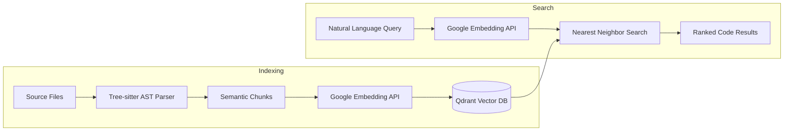
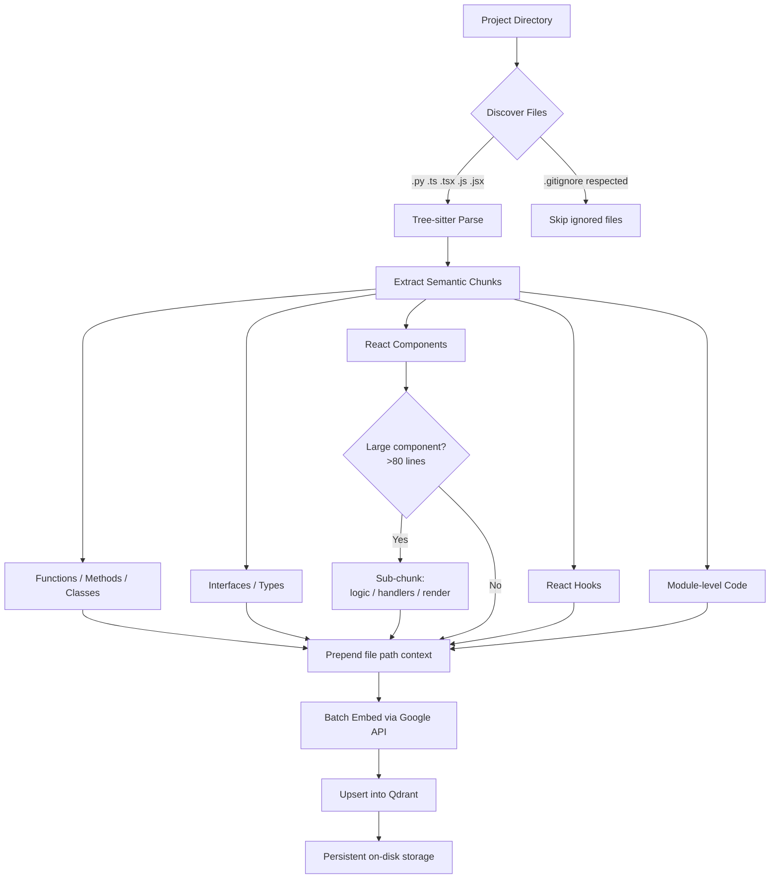
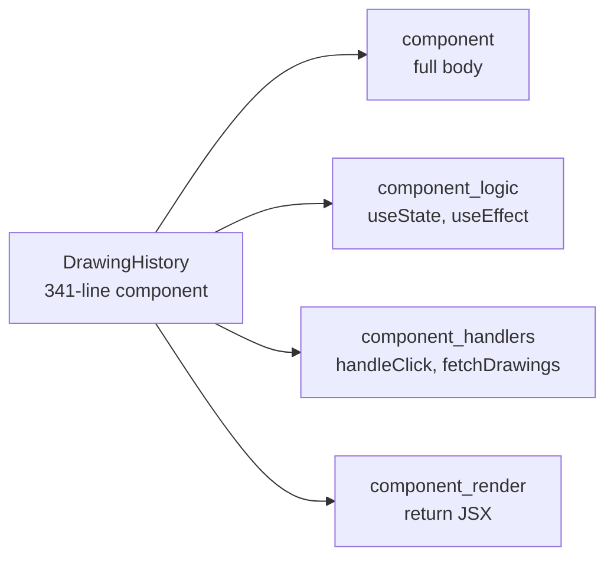
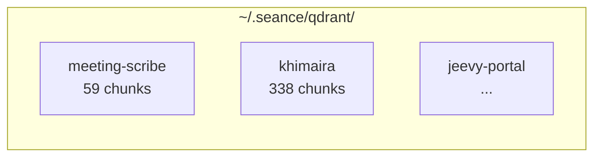
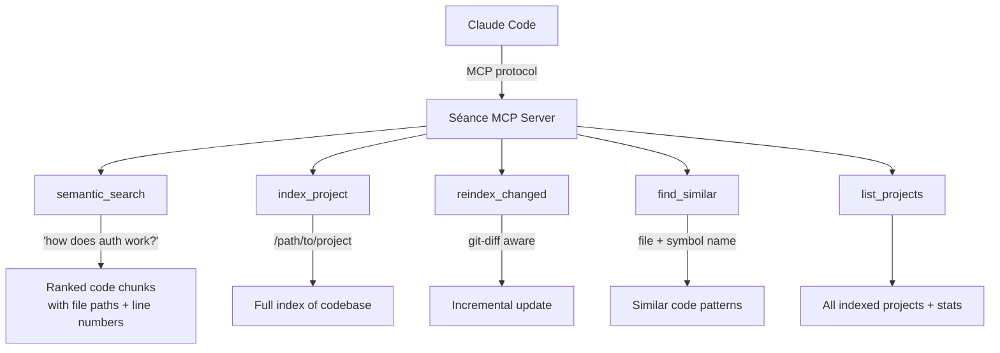
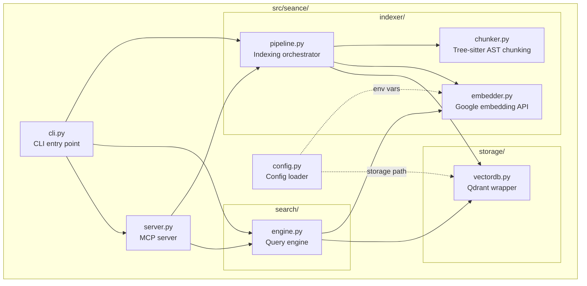
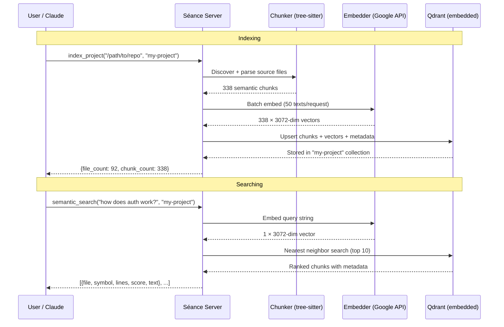

# Séance

Semantic codebase search as an MCP server. Indexes source code into vector embeddings using AST-aware chunking and serves natural language queries over those embeddings. Gives AI assistants the ability to answer vague questions like *"how does auth work?"* without knowing exact symbol names.

Built for [Claude Code](https://docs.anthropic.com/en/docs/claude-code), but works with any MCP-compatible client.

## Why "Séance"

A séance, in the 19th-century spiritualist sense, is a ritual for communing with what cannot be reached directly — a structured sitting to hear voices from behind a veil. The word comes from the French *séance* ("a sitting"), but by the time it reached English it carried a specific meaning: *a deliberate attempt to access the hidden*.

That's the tool's function. `grep` reaches what you can already name. Séance reaches what you can't — you describe what you're looking for conceptually (*"how does auth work?"*, *"where are retries handled?"*, *"code related to payment processing"*) and the vector index answers back from the part of the codebase you couldn't point at by name.

It pairs with its sibling tool in the ritual:

> *To find what is hidden, hold a séance. To bind the names you find, give them to [Scarlet](https://github.com/fsocietydisobey/scarlet).*

Séance summons. Scarlet inscribes. Together they form a loop — reveal the hidden, then fix its name in a permanent record.

## How it works



### Indexing pipeline



### What gets chunked

Unlike naive line-based splitting, Séance uses **tree-sitter** to parse source code into an AST and extracts chunks at semantic boundaries. The chunker recognizes both general code structure and React-specific patterns.

| Chunk type | What it captures | Example |
|---|---|---|
| `function` | Standalone functions, helpers, utilities | `def hash_password(...)` |
| `class` | Full class definition including constructor and docstring | `class VectorStore:` |
| `method` | Individual methods within a class | `VectorStore.upsert_chunks(...)` |
| `interface` | TypeScript interface declarations | `interface SearchResult { ... }` |
| `type_alias` | TypeScript type aliases | `type Config = { ... }` |
| `module` | Module-level imports, constants, and statements | Top-of-file setup code |
| `component` | React components (PascalCase functions/consts) | `const LoginForm = () => { ... }` |
| `hook` | React custom hooks (functions prefixed with `use`) | `function useRecentItems() { ... }` |
| `component_logic` | Sub-chunk: hooks + state within a large component | `useState`, `useEffect` declarations |
| `component_handlers` | Sub-chunk: event handlers within a large component | `const handleSubmit = ...` |
| `component_render` | Sub-chunk: JSX return within a large component | The `return (...)` statement |

Each chunk carries metadata: file path, symbol name, symbol type, language, and line range — so search results are immediately actionable.

### React component sub-chunking

Modern React components are large (200+ lines) and mix state, effects, handlers, and JSX in one function body. Treating them as a single chunk dilutes semantic retrieval. When a component exceeds ~80 lines, Séance also emits **sub-chunks** alongside the full-component chunk:



This means a query for *"click handlers in the drawing list"* matches `component_handlers` precisely, instead of competing against 300 lines of surrounding noise. You can also filter search by `chunk_type=component_handlers` to restrict results to handler sections only.

### File path context in embeddings

Folder structure is strong semantic signal in feature-organized codebases. Before embedding, Séance prepends a context header to each chunk:

```
// File: frontend/src/features/auth/components/LoginForm.tsx
// Symbol: LoginForm (component)
// Language: typescript
const LoginForm = ({ onSuccess }) => { ... }
```

This lets the embedding model associate the code with its location in the project hierarchy, dramatically improving queries like *"login form in the auth feature"* or *"the dashboard user card"* where the answer is as much about *where* the code lives as *what* it does.

### Vector storage

Séance uses **Qdrant** in embedded mode — no Docker, no server process. The Qdrant engine runs inside the Python process and persists data to `~/.seance/qdrant/`. Each indexed project gets its own collection.



## Supported languages

| Language | Extensions | Parser |
|---|---|---|
| Python | `.py` | `tree-sitter-python` |
| TypeScript | `.ts`, `.tsx` | `tree-sitter-typescript` |
| JavaScript | `.js`, `.jsx`, `.mjs` | `tree-sitter-javascript` |

## Installation

### Prerequisites

- Python 3.12+
- [uv](https://docs.astral.sh/uv/) package manager
- A [Google AI API key](https://aistudio.google.com/app/apikey) (for embeddings)

### Setup

```bash
git clone git@github.com:fsocietydisobey/seance.git
cd seance
uv sync
```

Set your Google AI API key:

```bash
export GOOGLE_AI_API_KEY=your_key_here
```

Or create a `.env` file (see `.env.example`).

## CLI usage

### Index a codebase

```bash
# Full index — parses, chunks, embeds, and stores everything
uv run seance index /path/to/project --name my-project

# Incremental reindex — only re-embeds files changed since last git commit
uv run seance reindex /path/to/project --name my-project
```

### Search

```bash
# Natural language search
uv run seance search my-project "how does authentication work"

# Filter by language
uv run seance search my-project "error handling" --language python

# Filter by chunk type
uv run seance search my-project "data models" --type class

# Limit results
uv run seance search my-project "API endpoints" -k 5
```

### List indexed projects

```bash
uv run seance list
```

### Start MCP server

```bash
uv run seance serve
```

## MCP integration

### Claude Code

Register Séance as an MCP server so Claude can search your codebases during conversations:

```bash
claude mcp add seance -- uv --directory /path/to/seance run seance serve
```

Once registered, Claude gets these tools:



### MCP tools

| Tool | Description | Example |
|---|---|---|
| `semantic_search` | Natural language code search | *"payment processing flow"* |
| `index_project` | Full index of a project directory | Index before first search |
| `reindex_changed` | Incremental reindex via git diff | Fast update after code changes |
| `find_similar` | Find code similar to a given symbol | Duplicate detection, pattern finding |
| `list_projects` | List all indexed projects with chunk counts | Check what's indexed |

### Other MCP clients

Séance uses the standard [MCP protocol](https://modelcontextprotocol.io/) over stdio. Any MCP-compatible client can use it. Add to your client's MCP config:

```json
{
  "mcpServers": {
    "seance": {
      "command": "uv",
      "args": [
        "--directory", "/path/to/seance",
        "run", "seance", "serve"
      ]
    }
  }
}
```

## Architecture



### Data flow



## Configuration

All configuration via environment variables. See `.env.example` for the full list.

| Variable | Required | Default | Description |
|---|---|---|---|
| `GOOGLE_AI_API_KEY` | Yes | — | Google AI API key for embeddings |
| `SEANCE_STORAGE_DIR` | No | `~/.seance/` | Where Qdrant stores vector data |
| `SEANCE_EMBEDDING_MODEL` | No | `gemini-embedding-001` | Embedding model to use |
| `SEANCE_CHUNK_OVERLAP` | No | `2` | Line overlap between chunks |

## Rate limits

The Google AI free tier allows ~100 embedding texts per minute. Séance handles this automatically with retry + exponential backoff, but initial indexing of large codebases will be slow:

| Project size | Chunks | Free tier time | Paid tier time |
|---|---|---|---|
| Small (~15 files) | ~60 | ~2 seconds | ~2 seconds |
| Medium (~100 files) | ~350 | ~4 minutes | ~3 seconds |
| Large (~500 files) | ~2000 | ~20 minutes | ~10 seconds |

Enabling billing on your Google AI project eliminates the rate limit bottleneck. Alternatively, incremental reindex (`seance reindex`) only processes changed files and is fast regardless of project size.

## Tech stack

- **[tree-sitter](https://tree-sitter.github.io/)** — AST parsing for Python, TypeScript, JavaScript
- **[Qdrant](https://qdrant.tech/)** — Vector database (embedded mode, no Docker needed)
- **[Google Gemini Embedding API](https://ai.google.dev/)** — `gemini-embedding-001` (3072-dim vectors)
- **[MCP Python SDK](https://github.com/modelcontextprotocol/python-sdk)** — Model Context Protocol server
- **[Click](https://click.palletsprojects.com/)** — CLI framework
- **[uv](https://docs.astral.sh/uv/)** — Package management and virtual environments

## License

MIT
