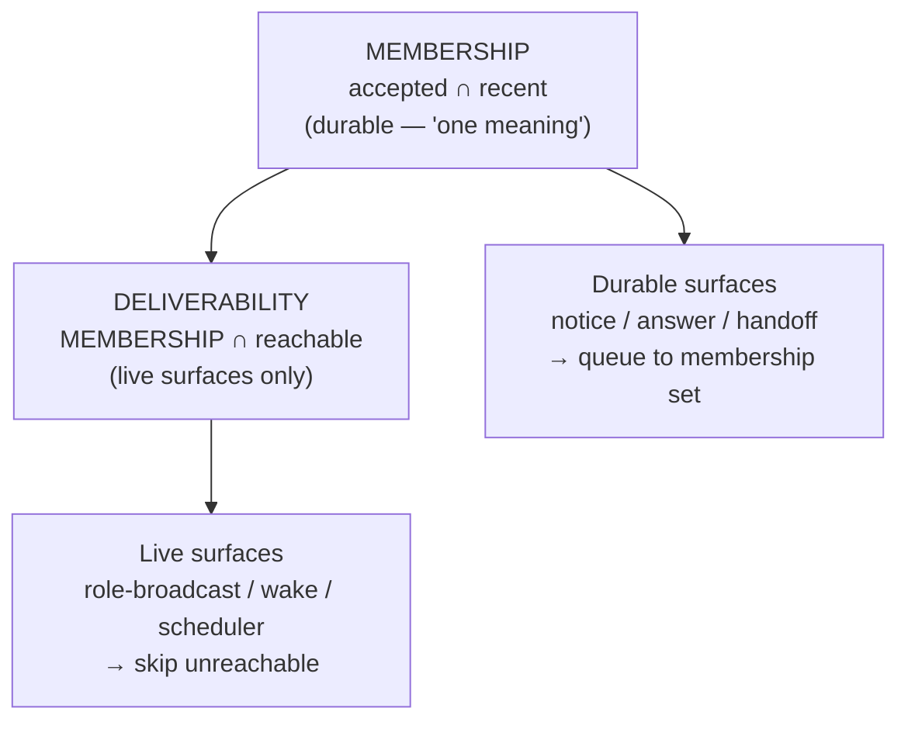
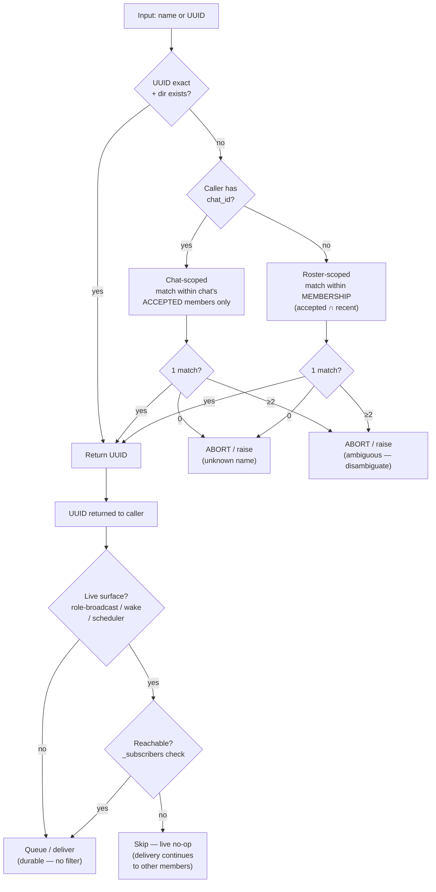

# Naming-Resolution Design

**Status:** Master-approved (architecture); pending janice gate + impl.
**Design session:** khimaira roster chat, 2026-05-31 → 2026-06-01.
**Authors:** architect-1 (design, proposals) · analyst-1 (adversarial review, invariant) · master (coverage, sequencing).

---

## 1. Problem

### Root cause: name-reuse-as-routing-key with no eviction

`resolve_session_id` (sessions.py:792) is the global name resolver. It resolves a friendly name (e.g. `architect-1`) to a session UUID by scanning ALL session directories and returning the most-recently-active match — a global mtime-heuristic tiebreak with no roster-scoping, no reachability check, and no eviction of dead seats.

This is the **GAP-5 root**: when two sessions share the same name (e.g. a live `khimaira-0` b401499d and a dead `khimaira-0` d13300a7), the heuristic silently resolves to whichever has the most-recently-touched directory — which may not be the live or intended seat. Messages, handoffs, and role-broadcasts land in the wrong terminal.

### The three-membership-view divergence

"Roster member" has three inconsistent definitions that can diverge:

| View | Source | What it tracks |
|---|---|---|
| (a) `member_roles` | chats.py JSONL | Role assignment — persists after session leaves |
| (b) accepted/left state | chat membership events | Live membership in the chat |
| (c) `session_list` | sessions directory | Process-level session existence |

**Live evidence:** 3 sessions appeared in member_roles (a) + session_list (c) as roster members yet were `left` in chat state (b), blocking task assignment with 403 errors. The role-broadcast storm was amplified by role-directives targeting these ghost entries.

`observer-1` (dark 58h at time of writing, no obligation) is a concrete P3-eviction target: Guard-6 alerts but the session remains a member until manual-drop or 7-day GC.

---

## 2. Surface Enumeration

All routing surfaces audited. ~30 callers total; ~15 are self-targeting (caller passes its own session_id — low risk). The high-risk surfaces funnel through `resolve_session_id` or `_resolve_or_uuid`.

| Surface | Resolution basis | Status | Layer |
|---|---|---|---|
| `resolve_session_id` (sessions.py:792) | GLOBAL name → mtime/heartbeat/decisions tiebreak | **BROKEN** — GAP-5 root | substrate |
| `post_notice` (sessions.py:2067) | → resolve_session_id | **BROKEN** (inherits) | substrate |
| `post_answer` (sessions.py:911) | → resolve_session_id | **BROKEN** (inherits) | substrate |
| `session_log_question(target)` (sessions.py:544) | → resolve_session_id | **BROKEN** (inherits) | substrate |
| `session_invite_handoff` invitee (sessions.py:1795) | → resolve_session_id | **BROKEN** — wrong invitee | substrate |
| Transcript family (:1636/:1674/:1713) | → resolve_session_id | **BROKEN** for display | substrate |
| `session_state` (sessions.py) | → resolve_session_id | **BROKEN** for display | substrate |
| `scheduler.py:181/:230` | → resolve_session_id | **BROKEN (delayed)** — fires into wrong seat at trigger-time, detached from assigner | substrate |
| `resolve_active_session` (sessions.py:302) | GLOBAL name → most-recently-active, active-aware | **PARTIAL** — active-aware but still global, not roster-scoped | substrate |
| `_resolve_or_uuid` (chats.py:505) | chat-scoped accepted-members THEN global fallback | **BROKEN fallback** — chat-scoped attempt passes, global fallback after miss; two same-named accepted members → wrong seat | substrate |
| `chat_*` (send_to, task_create, invite, transfer) | → `_resolve_or_uuid` | **BROKEN** (inherits fallback) | substrate |
| `/khimaira-assign` skill | matches status.name globally before shared-chat check | **BROKEN-ish** | skill |
| handoff claiming (`consume_handoffs`) | cwd first-come, no role filter | **BROKEN** — jp-analyst ate jp-master's handoff | substrate |
| `_emit_role_directive` (chats.py:323) | chat-scoped + UUID target from member_roles | **SAFE** — chat-scoped + UUID | substrate |
| `_find_chat_master` (api/chats.py) | chat-scoped member_roles | **SAFE** | substrate |
| `active_roster_member_ids` (sessions.py) | chat-scoped: accepted ∩ recently-active | **SAFE** | substrate |
| `desktop_notify` | passed UUIDs, no resolution | **SAFE** | substrate |
| Self-targeting ops (set_status, ack_notes, etc.) | caller passes own id | **LOW RISK** | substrate |

**Single-funnel insight:** every BROKEN surface routes through `resolve_session_id` or `_resolve_or_uuid:505`. Fixing those two substrates corrects all ~30 callers simultaneously — not whack-a-mole.

---

## 3. The Load-Bearing Invariant

```
MEMBERSHIP (accepted ∩ recent — durable, "one meaning")
≠
DELIVERABILITY (reachable — transient, live-surface overlay only)
```

**Reachability is a delivery-time overlay, never a membership criterion.**

- A **durable** surface (post_notice, post_answer, post_handoff) resolves to the membership set and queues to the alive-but-unreachable seat. That is the correct behavior — the message lands in the inbox and surfaces on next SessionStart. Filtering by reachability would cause irreversible message-loss.
- A **live** surface (role-broadcast, wake-injection, scheduler-at-fire-time) applies `MEMBERSHIP ∩ reachable` as an overlay at delivery time — live delivery to a dark terminal is pointless and the routing should skip it.

**Safe-direction justification:** a durable message queued to an unreachable seat is recoverable (delivered on reconnect); a durable message lost because the resolver filtered out an unreachable seat is NOT recoverable. Default toward the recoverable failure.



---

## 4. P2 — Chat-Scoped + Reachability-Aware Resolver

**What changes:** `resolve_session_id` (sessions.py:792) + `_resolve_or_uuid` (chats.py:505).

### Resolution precedence



> **Key:** reachability is applied by the **caller/surface** at delivery time — it is NOT part of the resolver. The resolver returns a UUID from MEMBERSHIP; live surfaces then apply the `∩ reachable` overlay. Durable surfaces (notice/answer/handoff) skip the overlay entirely and queue to the membership match, even if unreachable.

**DROP the global mtime-heuristic.** The ambiguity-abort already shipped in `roster_recovery._resolve_session_for_role` — generalize it as the resolver default.

**Durable vs live split (applied post-resolution by the caller):**
- **Durable** (notice/answer/handoff/log_question): caller delivers to the resolved UUID with no reachability check. An unreachable-but-alive seat still receives the message in its inbox. Ambiguity (≥2 alive same-named after scoping) → resolver ABORTs — caller must disambiguate, never reachability-guess.
- **Live** (role-broadcast / wake / scheduler-at-fire-time): caller checks `is_reachable(uuid)` AFTER resolver returns. Unreachable → skip (no-op for that delivery; broadcast continues to other members). This is a per-surface overlay, not a resolver filter.

---

## 5. P3 — Derived-View Eviction

### Effective roster as a derived view

Do NOT physically evict from `member_roles`. Instead:

```
effective_member_roles = member_roles ∩ MEMBERSHIP
```

where `MEMBERSHIP = active_roster_member_ids()` = accepted ∩ recently-active (last-message-ts < 7d, durable reads — agent-1's existing predicate, no reachability filter).

**Benefits:**
- **Reversible by construction** — no mutation of member_roles required. A session that re-registers / resumes activity auto-re-enters the derived view. No false-permanent-evict.
- Role-assignment is retained in member_roles — re-entry restores the role automatically.
- Collapses the three-membership-view divergence into one definition: member_roles and session_list become inputs to the view, not independent truths.
- Role-broadcast and resolver target the intersection, not raw member_roles → eliminates the storm-amplifier targeting ghost entries.

### Session lifecycle under P3

```
active
  └─ idle (SSE-dropped, not yet past grace)
       └─ transient-dark (within grace window, idle→unreachable transition)
            └─ dark-past-grace → EXCLUDED from derived view (reversible; role retained)
                 └─ genuinely dead (>7d no activity) → slow physical GC
                      (member_roles GC + session_list tombstone)
                      ← the ONLY irreversible step
```

**Key nuance (architect):** dark ≠ member-evicted. The 45-minute Guard-6 threshold triggers an ALERT; eviction from the derived view is manual-drop or 7-day GC. A Guard-6 alert on a dark session does NOT automatically remove it from routing targets — only from the live-surface deliverability overlay.

**Grace window:** keyed on the `idle→unreachable transition` (NOT restart time). A post-restart mass-unreachable event (all SSEs dropped) hits the grace window correctly; a session that was active since the last restart and later goes quiet has its own per-session grace. Prevents post-restart mass-exclusion.

### Runner

Guard-6-adjacent (already sweeps dark+unreachable on a 5-min loop). Add a reconcile step: `confirmed-genuine-dead` (dark+unreachable past grace, not active-since-restart) → member added to derived-view exclude-list (soft). Physical GC at 7d.

---

## 6. P4 — Role-Aware Handoff Claiming

**Problem:** `consume_handoffs` uses cwd first-come with no role filter — a jp-analyst session consumed a jp-master handoff in the same project.

**Fix:** add optional `target_role` to `post_handoff`. `consume_handoffs` claims only if the claiming session's Themis-enforced role matches `target_role` (role = None → anyone-in-cwd = current behavior, unchanged).

Role-gated first-come. The bug was cross-role, not same-role ordering — role-gating is the precise fix.

**Coordinate with:** `consume_handoffs` in sessions.py, which now carries the `mark_read` parameter from the W-HANDOFF-TRUNC fix (frontend-lead-1, commit 629aa59). Build on that, don't replace it.

---

## 7. P5 — @mention Ergonomics

**Principle:** keep names; bind to roster-instance; ghost-evict makes names safe.

- A name resolves to the roster-instance = accepted+reachable seat with that name (chat-scoped if in-chat). With P3 evicting ghosts, normally ONE seat → name unambiguous → @mention stays ergonomic.
- **Ghost-evict is what makes names safe** — today `@architect-1` is ambiguous because dead ghosts linger; evict them → the live seat is the sole resolution. We don't drop names; we drop ghosts.
- Genuine 2-LIVE-same-named (rare, deliberate) → resolver returns BOTH + requests disambiguation by suffix (@architect-1#b401), never silent-guess.
- Thin SessionStart-hook addition: surface "your roster-name=X; N other same-named seats exist" so a session knows when it's in an ambiguous state.

---

## 8. Implementation Sequencing

```
P2 (resolver fix) — highest leverage; fixes all ~30 callers simultaneously.
  ↓ unblocks
P3 (derived-view eviction) — depends on P2's MEMBERSHIP-scoped resolution
  ↓
P4 (role-aware claiming) — builds on P2 + existing mark_read (W-HANDOFF-TRUNC)
P5 (ergonomics hook) — independent of P2/P3/P4, can parallel-track
```

**File-conflict awareness:**
- P2/P3 touch `sessions.py` + `chats.py` — coordinate with agent-2's cleanup (8f60551) and frontend-lead-1's W-HANDOFF-TRUNC changes (629aa59).
- P4 touches `consume_handoffs` (sessions.py) — build on the `mark_read` parameter, do not replace it.
- P5 SessionStart hook — independent; can land any time.

**Gate:** janice-0 reviews the surface-set + eviction lifecycle before any implementation begins. architect-1 reviews the DESIGN.md for fidelity (durable/live split + MEMBERSHIP≠DELIVERABILITY invariant).

---

## References

Source messages (khimaira roster chat-fdf7c4cbd3bd, 2026-05-31 → 2026-06-01):
- Surface enumeration: msg-d5cf29db59d5, analyst additions in msg-5a123cdbda49
- Proposals 2-5: msg-89b7d4301700
- P2/P3 refinements: msg-03328ef7bc0b, msg-be58a9d7c0eb
- MEMBERSHIP≠DELIVERABILITY invariant: msg-67ea4f5ef776, msg-be58a9d7c0eb
- Architect concession + final form: msg-be58a9d7c0eb
- Master gate: msg-bfddb53f729c
