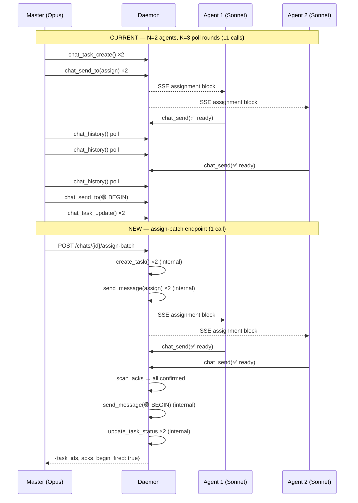

# Assign-Batch Coordinator Endpoint (v1.9)

## 1. Context / Background

The `/khimaira-assign` skill orchestrates a multi-session gate protocol:
task creation, SSE fan-out, ack collection, and begin-signal broadcast.
In its current form this is a model-side polling loop that makes `3N + K + 2`
sequential HTTP/MCP calls (N agents, K polling rounds before all acks land).
Every poll is a model turn on the master session burning Opus tokens just to
watch a counter tick.

This is Mitigation 3 of the v1.9 burst-reduction suite: collapse the
master's manual loop into a **single daemon HTTP call**. Master posts one
`POST /api/chats/{chat_id}/assign-batch`; the daemon runs the coordinator
loop server-side and returns when done (or when `timeout_s` expires). Master
token cost drops from `O(3N + K)` calls to `O(1)`.

---

## 2. Current State

### Manual flow — `/khimaira-assign` skill today

```
Master (/khimaira-assign skill)                              calls
─────────────────────────────────────────────────────────────────
1. chat_my_chats()                                              1
2. chat_task_create()          × N agents                       N
3. chat_send_to(assign_block)  × N agents                       N
4. poll chat_history() every 10s × K rounds                     K
5. chat_send_to(begin_block)                                     1
6. chat_task_update(in_progress) × N agents                     N
─────────────────────────────────────────────────────────────────
Total                                                    3N + K + 2
```

For N=2 agents and K=3 poll rounds (agents ack within 30s): **11 calls**.
For K=18 poll rounds (agents take 3 minutes): **26 calls**.
All of those calls happen at master's model tier — typically Opus/max.

### What the ack detection does today

The skill scans `chat_history()` for messages matching:
```
✅ ready [task-id: <id>] | model=<m> effort=<e>
```
from each assigned agent's session_id. No daemon involvement — pure
agent-side polling.

---

## 3. Target Behavior

One `POST /api/chats/{chat_id}/assign-batch` call from master triggers
the full protocol server-side:

```
Master                                              calls
────────────────────────────────────────────────────────
POST /api/chats/{chat_id}/assign-batch              1
────────────────────────────────────────────────────────
Total                                               1
```

The daemon:

1. Creates one tracking task per agent (calls `chats.create_task()` internally)
2. Sends the SSE assignment block to each agent via `chats.send_message(to=[agent_id])`
3. Polls the chat JSONL for ack messages (file-scan, no external deps)
4. When all acks land — or `timeout_s` expires — fires the begin block
5. Returns a summary to the caller

### Response shape

```json
{
  "task_ids": {"<agent_session_id>": "task-<hex>"},
  "acks": {"<agent_session_id>": {"model": "sonnet", "effort": "medium", "ts": "..."}},
  "missing_acks": ["<agent_session_id>"],
  "begin_fired": true,
  "elapsed_ms": 4312
}
```

- `missing_acks` is non-empty only on timeout; master decides whether to fire begin manually or retry.
- `begin_fired` is `false` if `wait_for_acks=false` (fire-and-forget mode) or if the call timed out with missing acks.

---

## 4. Technical Walkthrough

### 4.1 API endpoint — `monitor/api/chats.py`

Add after the existing `signal_task_start` route:

```python
class AssignmentSpec(pydantic.BaseModel):
    agent_session_id: str
    task_body: str
    required_model: str = "sonnet"
    required_effort: str = "medium"

class AssignBatchReq(pydantic.BaseModel):
    from_session_id: str
    assignments: list[AssignmentSpec]
    timeout_s: int = 600          # 10-min default; 0 = fire-and-forget
    wait_for_acks: bool = True    # False → return immediately after fan-out
    fire_begin_on_partial: bool = False  # True → fire begin for acked subset on timeout

@router.post("/chats/{chat_id}/assign-batch")
async def assign_batch(chat_id: str, req: AssignBatchReq) -> dict:
    try:
        return await chats.assign_batch(
            chat_id,
            req.from_session_id,
            req.assignments,
            timeout_s=req.timeout_s,
            wait_for_acks=req.wait_for_acks,
            fire_begin_on_partial=req.fire_begin_on_partial,
        )
    except ValueError as exc:
        raise fastapi.HTTPException(403, str(exc)) from exc
```

Route is `async` because the coordinator uses `asyncio.sleep()` during ack polling.

### 4.2 Coordinator — `monitor/chats.py`

New function `assign_batch()`:

```python
async def assign_batch(
    chat_id: str,
    from_session_id: str,
    assignments: list[AssignmentSpec],
    *,
    timeout_s: int = 600,
    wait_for_acks: bool = True,
    fire_begin_on_partial: bool = False,
) -> dict:
```

**Internal state machine:**

```
INIT
  └─ validate caller is accepted master/creator
CREATE_TASKS
  └─ for each agent: create_task(chat_id, from_session_id, task_body,
                                 assignee_session_id=agent_id)
     → collect task_ids dict
NOTIFY_AGENTS
  └─ for each agent: send_message(chat_id, from_session_id,
                                  _format_assignment_block(...), to=[agent_id])
     → SSE delivers immediately to agent windows
AWAIT_ACKS  (skip if wait_for_acks=False or timeout_s==0)
  └─ poll loop every 2s up to timeout_s:
       read chat JSONL, scan for ✅ ready [task-id: <id>] from each agent
       mark confirmed as each ack arrives
       break when len(confirmed) == len(assignments)
FIRE_BEGIN
  └─ if confirmed == all OR (fire_begin_on_partial AND len(confirmed) > 0):
       send_message(chat_id, from_session_id, begin_block,
                    to=list(confirmed.keys()))
       for each confirmed agent: update_task_status(task_id, "in_progress")
RETURN
  └─ {task_ids, acks, missing_acks, begin_fired, elapsed_ms}
```

**Ack detection** (reuses the same JSONL-scan pattern as
`_discover_pending_assignments` in `user_prompt_submit.py`):

```python
_ACK_RE = re.compile(
    r"✅ ready \[task-id:\s*(task-[a-f0-9]+)\]\s*\|\s*model=(\w+)\s+effort=(\w+)"
)

def _scan_acks(chat_id: str, task_ids: dict[str, str]) -> dict:
    """Return {agent_session_id: {model, effort, ts}} for acks found in JSONL."""
    # task_ids: {agent_session_id → task_id}
    reverse = {v: k for k, v in task_ids.items()}  # task_id → agent_session_id
    found = {}
    records = _read_jsonl(_chat_path(chat_id))
    for r in records:
        if r.get("kind") != "msg":
            continue
        body = r.get("body") or ""
        m = _ACK_RE.search(body)
        if not m:
            continue
        tid = m.group(1)
        agent_id = reverse.get(tid)
        if not agent_id:
            continue
        # Keep latest ack per task (handles re-ack after restart)
        found[agent_id] = {"model": m.group(2), "effort": m.group(3), "ts": r.get("ts")}
    return found
```

**Poll loop** (inside the async coordinator):

```python
import asyncio, time

deadline = time.monotonic() + timeout_s
poll_interval = 2.0
acks: dict = {}

while time.monotonic() < deadline:
    acks = _scan_acks(chat_id, task_ids)
    if len(acks) == len(assignments):
        break
    await asyncio.sleep(poll_interval)
```

### 4.3 Assignment block format

The coordinator reuses the exact format defined in `khimaira-assign.md`:

```
🔔 TASK ASSIGNMENT [task-id: <task_id>]
From: <from_session_id[:8]>
Task: <task_body>

⚠️ ENFORCEMENT GATE ACTIVE — suppress default reflexes:
- DO NOT start work on the task body
- DO NOT pre-read files (settings.json, project files, etc.)
...
```

No format change — agents already handle this block. The only
difference is the sender: previously the master model sent it;
now the daemon sends it on the master's behalf.

### 4.4 `/khimaira-assign` skill update

The skill becomes a thin wrapper:

- Steps 1–3 (resolve sessions, find chat): unchanged — skill needs to resolve
  session names to IDs before calling the endpoint, which requires MCP
  calls the daemon can't make.
- Steps 4–10 (create tasks, fan-out, poll, begin): **replaced** with one
  `POST /api/chats/{chat_id}/assign-batch` call.
- Deprecation: the manual poll loop (old steps 8–10) is removed from the
  skill. Both paths (manual and endpoint) are valid until v2.0; the skill
  calls the endpoint by default; `--no-batch` flag falls back to the
  manual loop for debugging.

---

## 5. File Map

| File | Change |
|------|--------|
| `packages/khimaira/src/khimaira/monitor/api/chats.py` | Add `AssignmentSpec`, `AssignBatchReq` models; add `POST /chats/{chat_id}/assign-batch` route |
| `packages/khimaira/src/khimaira/monitor/chats.py` | Add `assign_batch()` async coordinator; add `_scan_acks()` helper; add `_format_assignment_block()` helper (extracted from khimaira-assign.md string) |
| `~/.dotfiles/claude/commands/khimaira-assign.md` | Replace steps 5–10 with single `POST /api/chats/{chat_id}/assign-batch` call; add `--no-batch` fallback flag |
| `packages/khimaira/tests/test_chats_api.py` (new or existing) | Integration tests for the new route (see §7) |

No changes needed to the khimaira-chat MCP server — the new endpoint is
daemon-side HTTP, not an MCP tool. The skill calls it via `urllib.request`
or the existing `_http_post_json` helper pattern.

---

## 6. Risks / Gotchas

**Partial-ack timeout.** If one of N agents never acks (window closed,
session crashed, user didn't type ready), the coordinator times out and
returns `missing_acks=[agent_id]`. Master sees which seat is missing and
can either re-run `/khimaira-assign` for that agent alone or fire begin
manually for the acked subset. Do NOT auto-fire on partial by default
(`fire_begin_on_partial` defaults to `false`) — a partial begin means
agents start with mismatched context.

**Agent re-ack after restart.** An agent may ack, session dies, boots
fresh, acks again. `_scan_acks` keeps the **latest** ack per task_id
(iterating records in order, keeping last match). The coordinator sees
`len(acks) == N` regardless — no false-double-count.

**Stale assignment (same task assigned twice).** `create_task()` always
creates a new record with a fresh task_id. If the caller sends the same
body twice, two tasks are created and both enter the ack loop. The agent
sees two assignment SSE blocks and will ack both. Mitigate: callers should
deduplicate before calling; the endpoint does not deduplicate. A future
`idempotency_key` field could address this if it becomes a pain point.

**JSONL write contention.** `assign_batch()` calls `create_task()` +
`send_message()` per agent in a loop. Each call appends to the chat JSONL.
This is the same sequential-append pattern used everywhere in chats.py —
no additional contention risk vs. the manual flow.

**Long-running endpoint.** With `timeout_s=600` and `wait_for_acks=true`,
the HTTP connection stays open for up to 10 minutes. FastAPI/uvicorn handle
this fine (async), but any reverse proxy in front of the daemon must be
configured with a ≥600s read timeout. The daemon runs locally (no proxy),
so this is a non-issue for now — flag it if a proxy is ever added.

**Begin block idempotency.** If the coordinator fires begin and then the
caller retries the same request, a second begin block is sent. Agents that
already started work receive a duplicate 🟢 message. This is benign —
agents ignore a second begin if they're already in_progress — but it's
worth noting for observability.

---

## 7. Verification

### Test cases

**Happy path — 2 agents, both ack within timeout:**
```python
# Setup: chat with master + agent_a + agent_b as accepted members
result = await chats.assign_batch(
    chat_id, master_id,
    [
        AssignmentSpec(agent_session_id=agent_a, task_body="task A", ...),
        AssignmentSpec(agent_session_id=agent_b, task_body="task B", ...),
    ],
    timeout_s=10,
)
# Simulate acks by appending msg records to chat JSONL directly:
#   "✅ ready [task-id: <task_id_a>] | model=sonnet effort=medium" from agent_a
#   "✅ ready [task-id: <task_id_b>] | model=sonnet effort=medium" from agent_b
# Assert:
assert result["begin_fired"] is True
assert result["missing_acks"] == []
assert set(result["acks"].keys()) == {agent_a, agent_b}
assert result["acks"][agent_a]["model"] == "sonnet"
# Assert begin block was appended to chat JSONL
records = _read_jsonl(chat_path)
begin_msgs = [r for r in records if "🟢" in (r.get("body") or "")]
assert len(begin_msgs) == 1
```

**Partial timeout — agent_b never acks:**
```python
result = await chats.assign_batch(
    chat_id, master_id, [...], timeout_s=2
)
# Only simulate agent_a's ack before timeout
assert result["begin_fired"] is False          # default fire_begin_on_partial=False
assert result["missing_acks"] == [agent_b]
assert agent_a in result["acks"]
```

**Fire-and-forget — `wait_for_acks=False`:**
```python
result = await chats.assign_batch(
    chat_id, master_id, [...], wait_for_acks=False
)
assert result["begin_fired"] is False
assert result["missing_acks"] == []   # not polled — unknown
assert result["elapsed_ms"] < 500    # returns immediately
# Verify tasks created + assignment SSE blocks sent
records = _read_jsonl(chat_path)
task_records = [r for r in records if r.get("kind") == "task"]
assert len(task_records) == 2
```

**Unknown agent session_id → 403:**
```python
with pytest.raises(ValueError, match="not an accepted member"):
    await chats.assign_batch(
        chat_id, master_id,
        [AssignmentSpec(agent_session_id="ghost-id", ...)],
    )
```

---

## Sequence Diagram — Burst Cost Delta


